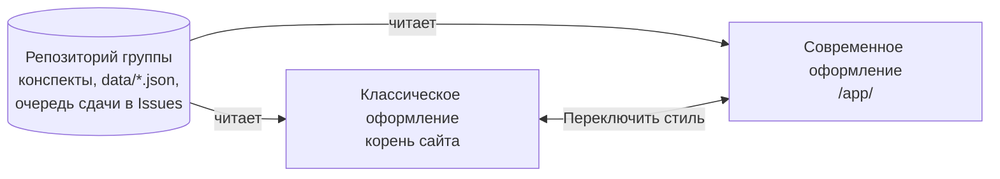

<div align="center">


# М3102

**Учебное пространство группы: расписание, дедлайны, домашние задания, конспекты и тесты в одном месте.**

Один сайт, два оформления, общие данные. Работает в браузере, без сервера и регистрации.

[](https://redstonelord.github.io/itmo-m3102/)
[](https://redstonelord.github.io/itmo-m3102/app/)

[Открыть сайт](https://redstonelord.github.io/itmo-m3102/) · [Современное оформление](https://redstonelord.github.io/itmo-m3102/app/) · [Репозиторий группы](https://github.com/RedstoneLord/itmo-m3102)

</div>

## Содержание

[Что внутри](#что-внутри) · [Возможности](#возможности) · [Расписание и домашние задания](#расписание-и-домашние-задания) · [Диаграммы в конспектах](#диаграммы-в-конспектах) · [Как это устроено](#как-это-устроено) · [Установка как приложение](#установка-как-приложение) · [Запуск и разработка](#запуск-и-разработка) · [Структура репозитория](#структура-репозитория) · [Публикация](#публикация) · [Документация](#документация)

## Что внутри

Сайт группы М3102 (ИТМО, 1 курс) существует в двух оформлениях. Данные у них одни и те же: расписание, домашние задания, дедлайны, ссылки, мемы и конспекты берутся из репозитория группы, а личные отметки лежат только в браузере. Между оформлениями переключает кнопка «Переключить стиль» в шапке: цветная волна из точки нажатия.

| | Классическое | Современное |
|---|---|---|
| Адрес | [корень сайта](https://redstonelord.github.io/itmo-m3102/) | [/app/](https://redstonelord.github.io/itmo-m3102/app/) |
| Характер | простое и понятное: крупные кнопки, всё на виду | богатое по возможностям: тесты, повторение, календарь, заметки |
| Технологии | статический сайт без сборки: HTML, CSS, ES-модули | React, TypeScript, Vite |
| Где в репозитории | корень: `index.html`, `css/`, `js/`, `data/` | папка [`app/`](app/README.md) |

Классическое оформление открывается первым: оно проще и привычнее. Современное подходит тем, кому нужны повторение, календарь в телефоне, заметки и работа без интернета.

## Возможности

В обоих оформлениях есть то, что нужно каждый день; современное добавляет учёбу «с умом» и удобства. Пустая клетка значит, что в этом оформлении такой функции нет.

| Раздел | Классическое | Современное |
|---|---|---|
| **Расписание** | неделя и день, чётные и нечётные недели, аудитории и преподаватели; редактор расписания («Изменить», «Только этот день») | неделя сеткой по часам на ПК и список по дням на телефоне, перемены и прогресс идущей пары, переносы и замены; месяц в календаре |
| **Домашние задания** | общие ДЗ группы к парам со сроком, отметка «сделано»; сохранение в GitHub | то же, плюс ДЗ видны в календаре и на странице предмета |
| **Дедлайны** | карточки сроков, общая очередь на сдачу через GitHub Issues, отметка «выполнено для меня» | то же; в очереди имена и фото из GitHub, профиль студента по нажатию, понятная ошибка при лимите GitHub |
| **Конспекты** | чтение Markdown с формулами и подсветкой кода, PDF по страницам, печать, боковая панель лекций | предмет → папка занятия, оглавление, закладки и пометки в тексте, PDF с тёмными страницами и «продолжить с места», «Скачать PDF» с водяным знаком, печать без обрезки |
| **Схемы** | блоки `graph`, `plot`, `chart`, `tree`, `array`, `diagram`, `canvas`; пошаговое выполнение кода над массивом; страница «Диаграммы» с редактором | то же и редактор схем, где узлы двигают мышью, с экспортом и ссылкой |
| **Тесты** | интерактивные тесты в конспектах (один ответ, несколько, ввод текста) | то же, плюс тесты к конспектам, повторение ошибок через 1, 3, 7 и 14 дней, режим экзамена «Перед контрольной», разбор своих ответов |
| **Поиск** | поиск по сайту (клавиша `/`) по тексту конспектов | `Ctrl+K`: по тексту конспектов и PDF, по подписям схем, фильтры по типу и предмету, быстрые действия |
| **Календарь** | | события и дедлайны в одном месте; подписка для Google и Apple Календаря, которая обновляется сама |
| **Личное** | «Мой учебный план» | учебный план, заметки, отметки «сделано», результаты тестов (всё только в этом браузере) |
| **Группа** | студенты, полезные ссылки, мемы | студенты с фото и контактами, ссылки, все файлы репозитория группы, мемы |
| **Работа без интернета** | кэш конспектов и данных | одной кнопкой в настройках: PDF, картинки и материалы на устройство, с размером заранее |
| **Для ИИ** | | все конспекты предмета одним Markdown-файлом, чтобы отдать ChatGPT или Claude |
| **Внешний вид** | стеклянное тёмное или светлое оформление по настройке системы, живой фон | светлая и тёмная тема, цвет акцента, сияние, сворачиваемое меню (`Ctrl+B`), lo-fi радио |
| **Ёжик** | игра «Ёжик-кувырок», бегущий ёжик на главной | маскот по всему сайту и своя версия игры |

Телефон поддерживается обоими оформлениями: внизу панель вкладок, крупные цели нажатия. В современном ещё жесты в расписании и установка как приложение.

## Расписание и домашние задания


В расписании выберите день, откройте карточку пары, добавьте домашнее задание. Срок по умолчанию — следующая пара по этому предмету с учётом каникул и разовых изменений. В тексте ДЗ работают `**жирный**`, `*курсив*`, `код`, списки с `-`, ссылки `https://…` и формулы `$…$`. На странице «Домашнее задание» можно видеть все актуальные, выполненные или все задания. Отметка «сделано» личная: она остаётся в `localStorage` и не публикуется.

Кнопка «Изменить» открывает редактор расписания. Режим «Только этот день» создаёт запись в `overrides`; режим «Общее расписание» меняет один день 14-дневного цикла. Изменения сначала становятся локальным черновиком. Без токена JSON можно скачать, скопировать или открыть в веб-редакторе GitHub.

Чтобы сохранить расписание или ДЗ для всей группы:

1. Откройте [настройки GitHub fine-grained PAT](https://github.com/settings/personal-access-tokens/new).
2. Выберите только репозиторий `RedstoneLord/itmo-m3102` и право **Contents: Read and write**. Создайте токен с коротким сроком действия.
3. Нажмите «Сохранить в GitHub» на сайте, вставьте токен и проверьте сообщение коммита. Чекбокс «Запомнить» хранит токен в `localStorage`; без него токен живёт только в текущей вкладке (`sessionStorage`). На общем компьютере не включайте этот чекбокс.

Токен не передаётся в адресе страницы и не включается в JSON. Кнопка «Забыть токен» находится в окне публикации расписания. Публикация использует GitHub Contents API и проверяет SHA удалённого файла. Для ДЗ локальные изменения сливаются с удалёнными по `id`; для расписания при конфликте предлагается применить только свои изменения поверх новой версии.

## Диаграммы в конспектах


Добавьте fenced-блок в `.md` конспект. Сайт сам построит SVG. Тип блока: `graph`, `plot`, `chart`, `tree`, `array`, `diagram` или `canvas`. Общие строки: `title:`, `caption:`, `width:`, `height:`. Комментарии начинаются с `#` или `//`.

````markdown
```graph
graph directed
layout: circle
A -> B : 5
B -> C : 2 {color: red}
A @ 120,80
```

```plot
plot
x: -5..5 y: -3..3 grid
y = sin(x) {color: blue, label: "sin x"}
y = x^2/4 - 1
(cos(t), sin(t)) t: 0..2*pi
point (1, 2) "A"
area y = x^2 from 0 to 2
tangent y = x^2 at 1
```

```chart
chart bar
title: Баллы
series: Тест | Экзамен
ДМ | 78 | 91
Алгебра | 72 | 88
```

```tree
tree
Корень
  Левый
  Правый
```

```array
array
[5, 2, 9, 1, 7] i=1 j=3 highlight: 2,3 sorted: 0
```

```diagram
diagram
A: round "Старт"
B: diamond "Условие"
C: box "Действие"
A -> B
B -> C
```

```canvas
canvas 400x200
rect 20 20 120 60 "Вход" fill=#eef
arrow 140 50 -> 220 50
circle 260 50 r=30 "q0"
text 20 150 "Подпись"
```
````

Для графа доступны `circle`, `grid`, `layered`, `force`, `manual`, ориентированные `->` и обычные `--` рёбра. Для `chart` доступны `bar`, `line`, `pie`, `scatter`. Для `array` — варианты `linked`, `stack`, `queue`. Цвета ограничены палитрой (`red`, `blue`, `green`, `purple`, `orange`, `gray`, `black`, `white`) или шестнадцатеричным `#rgb`/`#rrggbb`. Графики поддерживают `+ - * / ^`, скобки, неявное умножение, `pi`, `e`, `x`, `t` и функции `sin`, `cos`, `tan`, `sqrt`, `abs`, `log` и другие из подсказки редактора.

Страница «Диаграммы» содержит визуальный холст, текст DSL и превью. Вершины графа и блок-схемы перетаскиваются, граф можно дополнить вершинами и рёбрами, в том числе протягиванием между вершинами. Кнопка «Импорт» принимает список рёбер (`A B 5`) или матрицу смежности: первая строка — имена вершин через пробел, затем квадратная таблица чисел, где ноль означает отсутствие ребра. Фигуры холста тоже перетаскиваются. Для других языков есть структурные поля. Доступны отмена/повтор, SVG/PNG, Markdown-блок, ссылка с исходником и сохранение картинки в репозиторий. SVG сохраняется с разрешёнными цветами темы; PNG экспортируется с масштабом ×2. При сохранении PNG в репозиторий можно выбрать фон.

## Ограничения


Диаграммы рассчитаны на учебные примеры до 500 элементов, графики — до 4000 точек. В редакторе сохранение SVG/PNG идёт напрямую в выбранную папку репозитория и требует токена; без токена используйте скачивание. Текст DSL остаётся источником данных: произвольные комментарии сохраняются при точечных правках, но редактирование выбранной строки может заменить её форматирование. Mermaid, KaTeX, PDF, дедлайны и личный учебный план работают по прежним путям.

## Как это устроено



- **Данные** сайт читает из репозитория группы по сети. Список файлов запрашивается один раз, сами файлы берутся с `raw.githubusercontent.com` без ограничений, поэтому обновления конспектов видны сразу после сохранения.
- **Личное** (отметки, заметки, учебный план, результаты тестов) лежит в `localStorage` браузера и никуда не отправляется. Пароли ИТМО сайт не принимает ни в каком виде.
- **Запись в репозиторий** (сохранить расписание, ДЗ, мем) идёт через токен GitHub с правом на один репозиторий, который хранится только в браузере.
- **Переключение**: оба сайта подключают один скрипт ([`app/public/switch/site-switch.js`](app/public/switch/site-switch.js)), поэтому анимация и поведение одинаковые. Подробности устройства — в [AGENTS.md](AGENTS.md).

## Установка как приложение

Современное оформление ставится как приложение и дальше работает без сети:

- Android, Chrome: меню → «Установить приложение».
- iPhone, Safari: «Поделиться» → «На экран „Домой“».
- ПК, Chrome или Edge: значок установки в адресной строке.

Первый раз сайт нужно открыть с интернетом.

## Запуск и разработка

Классическое оформление запускается как есть, без сборки:

```bash
python3 -m http.server 8000
# открыть http://localhost:8000/
npm test        # тесты классического сайта
```

Сайт использует ES-модули и `fetch`, поэтому открывать `index.html` через `file://` нельзя. Данные лежат в `data/schedule.json` и `data/homework.json`. Изменения на GitHub Pages обычно появляются спустя несколько минут после коммита.

Современное оформление:

```bash
cd app
npm install
npm run dev          # приложение на http://localhost:5173, классический сайт на /classic/
npm test             # юнит-тесты
npm run test:e2e     # тесты в браузере (собирает сайт целиком)
npm run build
```

Правила разработки, устройство кода и принятые решения — в [AGENTS.md](AGENTS.md); описание приложения — в [app/README.md](app/README.md).

## Структура репозитория

```text
.
├── index.html, site.css, css/, js/, img/    классическое оформление (корень, как есть)
├── data/, Дедлайны/                          данные группы: расписание, ДЗ, ссылки, мемы, сроки
├── tests/                                    тесты классического сайта
├── app/                                      современное оформление (React)
│   ├── src/, public/, e2e/, scripts/         код, статика, тесты в браузере, сборка сайта
│   └── README.md                             описание приложения
├── docs/                                     документы (план сервера и др.)
├── AGENTS.md, CLAUDE.md                      правила и устройство для разработчиков и ИИ-агентов
└── .github/                                  автоматизация
```

Конспекты, материалы и записи лекций лежат в репозитории группы ([RedstoneLord/itmo-m3102](https://github.com/RedstoneLord/itmo-m3102)), оба оформления читают их оттуда.

## Публикация

Готовый сайт собирает одна команда в `app/` после сборки приложения:

```bash
cd app
npm run build
npm run site          # app/site: классическое в корне, приложение в /app/
```

Сам классический сайт при этом не меняется: правится только собранная копия `index.html` (подключается переключатель стиля). Свежие `data/` и `Дедлайны/` подтягивает `npm run site -- --fresh`. Как публиковать на GitHub Pages — в [AGENTS.md](AGENTS.md).

## Документация

- [AGENTS.md](AGENTS.md) — правила, устройство и решения: ветки, CI, переключатель стиля, дизайн, скорость, офлайн.
- [app/README.md](app/README.md) — подробно про современное оформление: возможности, календарь, данные, разработка.
- [docs/BACKEND_PLAN.md](docs/BACKEND_PLAN.md) — план сервера со входом через ITMO ID.

Спасибо всем, кто пишет конспекты, и [RedstoneLord](https://github.com/RedstoneLord/itmo-m3102) за исходный сайт группы.
