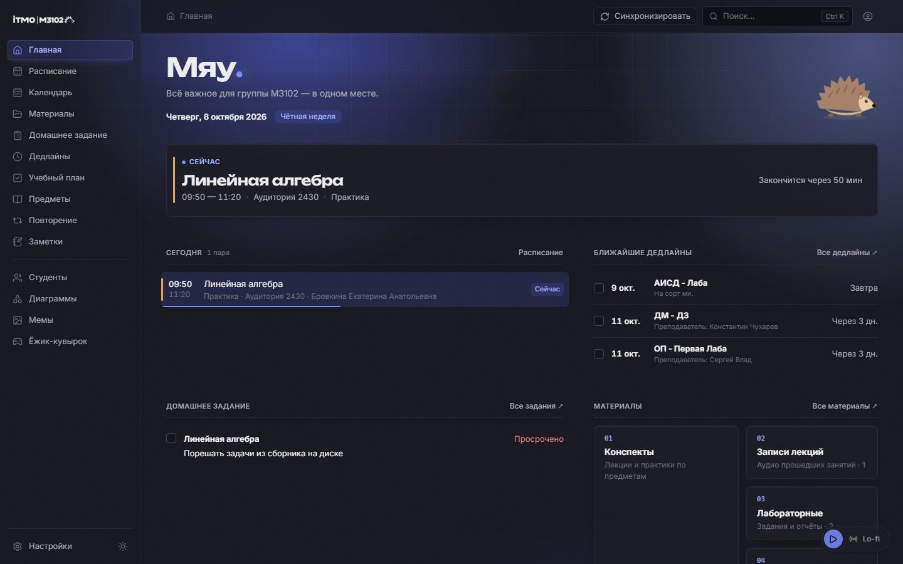
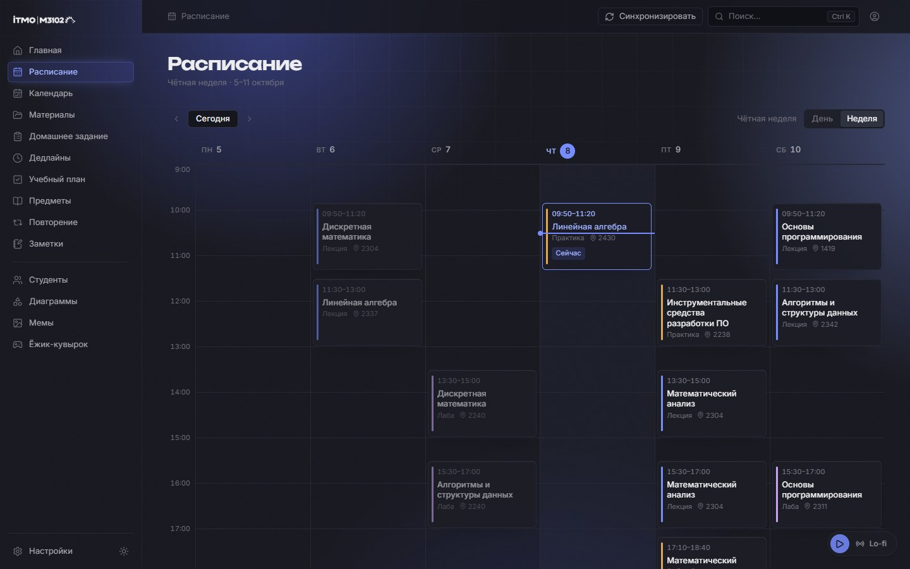
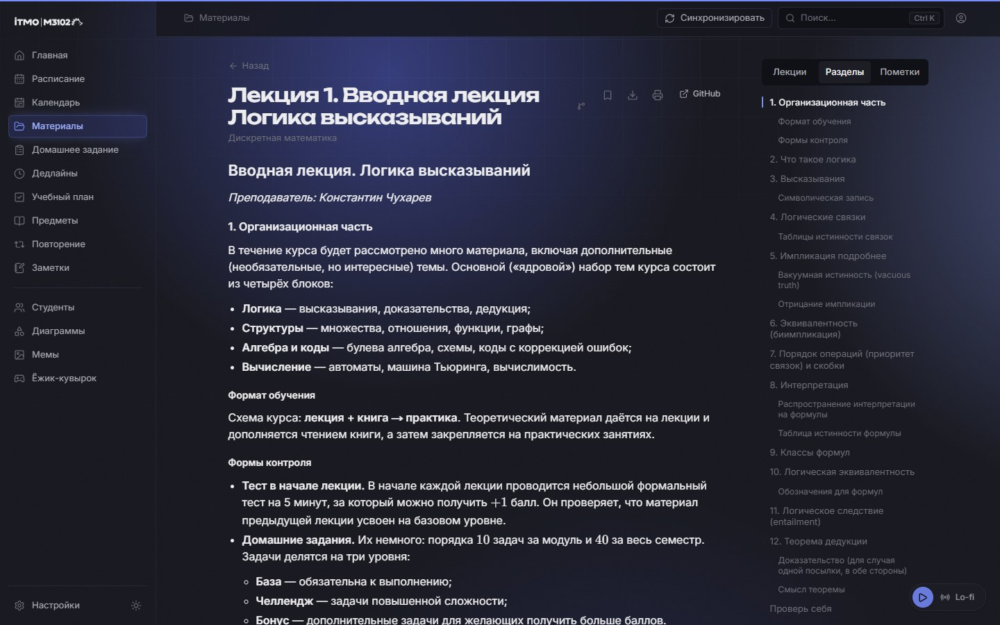
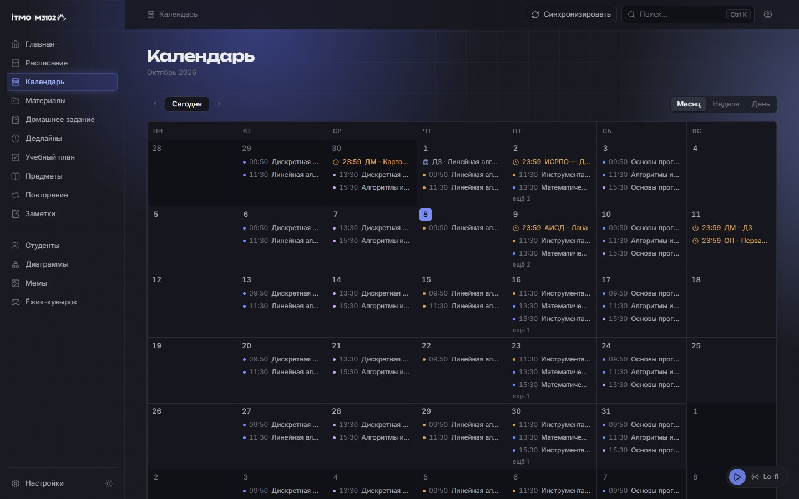
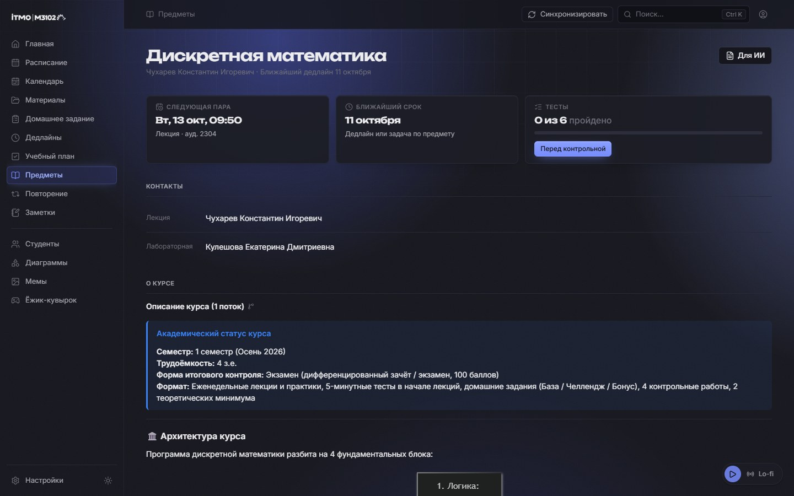
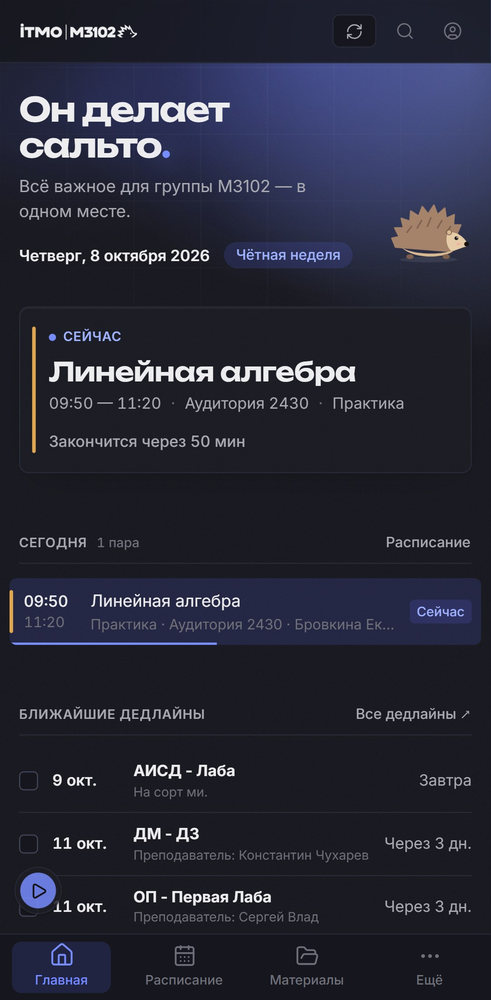
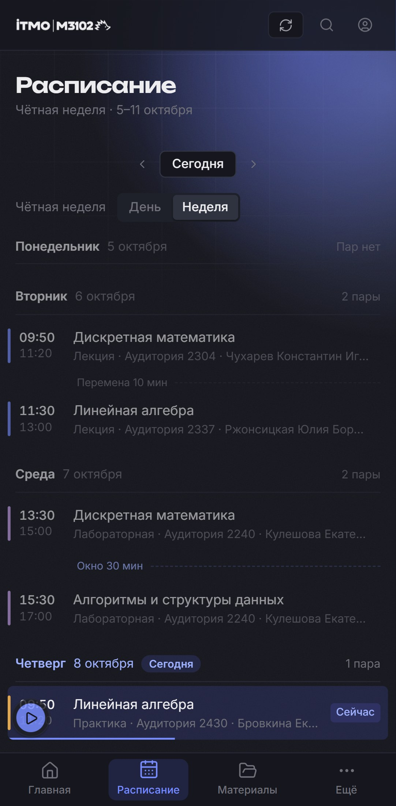
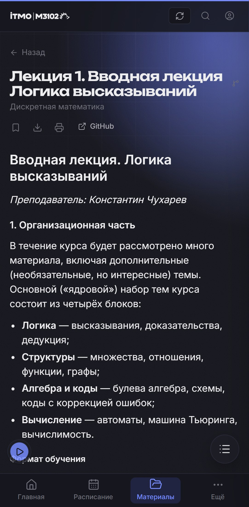
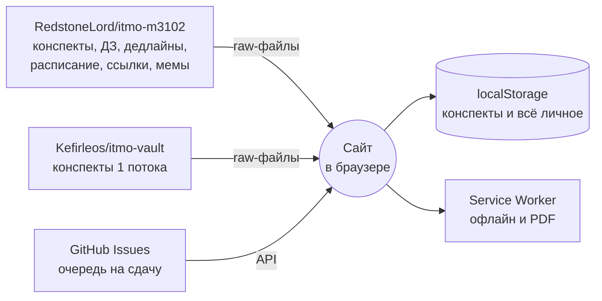
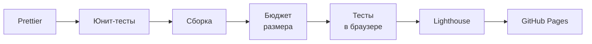

<div align="center">


# М3102 — учебное пространство группы

**Расписание, дедлайны, ДЗ, конспекты и тесты группы М3102 (ИТМО) — в одном месте.**<br/>
Работает в браузере без сервера и без регистрации, ставится как приложение и открывается без интернета.

<br/>

[](https://lazerprook1.github.io/itmo-m3102/)
[](#-установить-как-приложение)
[](#-конспекты-для-ии)
[](https://github.com/RedstoneLord/itmo-m3102)

[](https://github.com/LazerProOk1/itmo-m3102/actions/workflows/deploy-pages.yml)
[](https://github.com/LazerProOk1/itmo-m3102/commits/react-app)


[Возможности](#-возможности) · [Скриншоты](#-скриншоты) · [Установка](#-установить-как-приложение) · [Клавиши](#%EF%B8%8F-горячие-клавиши) · [Для ИИ](#-конспекты-для-ии) · [Откуда данные](#-откуда-данные) · [Разработка](#%EF%B8%8F-разработка)

<br/>



</div>

---

## ✨ Возможности

### 📅 Каждый день

- **Главная** — что идёт прямо сейчас и сколько до конца пары, пары на сегодня, ближайшие дедлайны, ДЗ,
  предметы, закладки и недавние конспекты. И ёжик — нажми, он сделает сальто.
- **Расписание** — на ПК неделя сеткой по часам (высота карточки — длительность пары, видно окна и линию «сейчас»),
  на телефоне — список по дням. Чётные и нечётные недели, переносы, отмены и замены, ДЗ прямо в карточке пары.
  Свайп влево-вправо листает дни.
- **Календарь** — месяц, неделя и день: пары, свои события, дедлайны группы и ДЗ в день сдачи.
- **Домашнее задание** — общее для группы, отметка «сделано» у каждого своя.
- **Дедлайны** — сроки, бейджи «завтра / через 3 дн.» и **общая очередь на сдачу**. В очереди — имя и фамилия
  по GitHub-аккаунту записавшегося, даже если в заголовке написано «Ладно Федя, я начну».

### 📚 Конспекты и учёба

- **Читалка** — формулы (KaTeX), схемы (Mermaid и свои: графы, графики, деревья, массивы), оглавление,
  соседние лекции, прогресс чтения, печать в PDF. Большой конспект показывается сразу и дорисовывается по разделам.
- **Закладки и пометки** — выделил текст → «Пометить»: пометка подсвечивается и попадает во вкладку «Пометки».
- **PDF** — учебники и конспекты прямо на сайте: тёмные страницы, масштаб, «Продолжить с N стр.».
- **Тесты «Проверь себя»** — к конспектам группы. Ошибки попадают в **повторение** (через 1, 3, 7, 14 дней),
  для предмета есть **режим экзамена** на 15 вопросов.
- **Поиск** (`Ctrl+K`) — по тексту всех конспектов, включая код и PDF, по ДЗ, дедлайнам, ссылкам и студентам.
- **Страница предмета** — занятия, конспекты, материалы, ссылки, контакты преподавателей и кнопка «Для ИИ».

### 🙋 Личное и группа

- **Учебный план, заметки, свои события** — только в твоём браузере, никто их не видит.
- **Студенты, мемы, полезные ссылки, файлы группы.**
- **Оформление** — светлая и тёмная тема, 8 акцентов и свой цвет, живой фон, свечение, скругления.
  Всё отключается в «Настройках».
- **Lo-fi радио** для учёбы и **«Ёжик-кувырок»** — игра для перемены.

## 📸 Скриншоты

<table>
  <tr>
    <td width="50%"><p align="center"><b>Неделя по часам</b> — идущая пара и линия «сейчас»</p></td>
    <td width="50%"><p align="center"><b>Читалка</b> — оглавление, лекции предмета, пометки</p></td>
  </tr>
  <tr>
    <td width="50%"><p align="center"><b>Календарь</b> — пары, дедлайны и ДЗ</p></td>
    <td width="50%"><p align="center"><b>Предмет</b> — всё по курсу и «Для ИИ»</p></td>
  </tr>
</table>

<div align="center">
<table>
  <tr>
    <td></td>
    <td></td>
    <td></td>
  </tr>
  <tr>
    <td align="center">Главная</td>
    <td align="center">Неделя по дням</td>
    <td align="center">Конспект</td>
  </tr>
</table>
</div>

## 📱 Установить как приложение

Сайт — PWA: ставится на главный экран, открывается без адресной строки и **работает без интернета**
(в метро, в аудитории без Wi-Fi). Конспекты уже лежат на устройстве, открытые PDF — в кеше.

| Где | Как |
|---|---|
| **Android** (Chrome) | меню ⋮ → **«Установить приложение»** или «Добавить на главный экран» |
| **iPhone** (Safari) | «Поделиться» → **«На экран „Домой“»** |
| **ПК** (Chrome, Edge) | значок установки справа в адресной строке |

> [!TIP]
> Первый раз сайт нужно открыть с интернетом — он скачает конспекты. Дальше обновляется сам при каждом открытии
> (не чаще раза в 10 минут), а без сети показывает сохранённое.

## ⌨️ Горячие клавиши

Полный список — по клавише `?` на сайте.

| Клавиши | Что делают |
|---|---|
| `Ctrl` `K` (`⌘` `K`) | поиск по всему |
| `?` | список горячих клавиш |
| `Esc` | закрыть окно или меню |
| `←` `→` · `Home` `End` | соседняя вкладка или день, первая или последняя |
| `1`–`9` · `Enter` | в тесте: выбрать вариант, проверить и дальше |
| `Пробел` · `←` `→` · `P` | в игре: свернуться и прыгнуть, сальто, пауза |

## 🤖 Конспекты для ИИ

На странице любого предмета есть кнопка **«Для ИИ»**: «Скачать .md» или «Скопировать текст». Получается
**один файл со всем по предмету**. Его кидаешь в ChatGPT или Claude, и ИИ сразу читает всё целиком, а не ходит
по сайту и не ищет конспекты, тратя токены.

В файле: описание курса, оглавление, все конспекты группы и 1 потока по порядку занятий (у каждого ссылка
на оригинал), текст PDF-конспектов, материалы и ссылки, твои заметки. PDF, которые повторяют `.md`
того же занятия, идут ссылкой, а не вторым текстом. После скачивания кнопка покажет примерный размер в токенах:
по ДМ около 74 тыс., по линалу около 46 тыс.

> [!TIP]
> В Claude удобно положить файл в **«Проект»** — он будет доступен во всех чатах проекта. В ChatGPT
> прикрепляй его файлом, а не вставляй текстом.

## 🔄 Откуда данные

Сервера у сайта нет: всё берётся из публичных репозиториев GitHub и хранится в браузере.



- Синхронизация — при открытии сайта (не чаще раза в 10 минут) и кнопкой в шапке. Неизменённые файлы
  повторно не скачиваются: сайт сверяет их версию (sha) с деревом репозитория.
- Список файлов берётся через GitHub API: без токена у него **60 запросов в час** на сеть. Если упёрлись в лимит,
  сайт покажет сохранённые данные и время, когда лимит обновится.
- Форматы файлов — как у сайта группы: `Конспекты/{Предмет}/{Лекция_N}/…`, `Дедлайны/deadlines.json`,
  `data/homework.json`, `data/links.json`, `data/schedule.json`, `data/memes.json`.

### 🔒 Что где хранится

| Данные | Где | Кто видит |
|---|---|---|
| Конспекты, ДЗ, дедлайны, расписание | репозитории группы → кеш в твоём браузере | все |
| Очередь на сдачу | GitHub Issues репозитория группы | все |
| «Сделано», учебный план, заметки, пометки, закладки, результаты тестов, настройки | только `localStorage` этого браузера | только ты |
| GitHub-токен (если ввёл в режиме редактирования) | вкладка браузера или `localStorage` по «Запомнить» | только ты |

> [!NOTE]
> Личное не синхронизируется между устройствами, а очистка данных сайта удаляет его. Сервер с входом
> через ITMO ID и синхронизацией описан в [docs/BACKEND_PLAN.md](docs/BACKEND_PLAN.md).

## 🛠️ Разработка

```bash
npm install
npm run dev        # http://localhost:5173
```

| Команда | Что делает |
|---|---|
| `npm test` | юнит-тесты (Vitest, `*.test.ts` рядом с кодом) |
| `npm run test:e2e` | собирает сайт и гоняет сценарии в браузере (Playwright, `e2e/`) |
| `npm run typecheck` | TypeScript в строгом режиме |
| `npm run format` · `format:check` | Prettier |
| `npm run build` | проверка типов и сборка в `dist/` |
| `npm run size` | бюджет размера сборки (после `build`) |
| `npm run lighthouse` | Lighthouse по `dist/` |

**Стек:** React 19 · TypeScript 7 (strict) · Vite 8 · React Router (HashRouter — GitHub Pages) · Zustand ·
Framer Motion · react-markdown + KaTeX + Mermaid · react-pdf · Vitest + Testing Library · Playwright.

<details>
<summary><b>Что проверяет CI перед каждой публикацией</b></summary>

<br/>



- **Бюджет размера:** код первой загрузки не больше 215 КБ gzip, любая страница не больше 220 КБ.
- **Тесты в браузере:** переход с главной на предмет быстрее секунды, поиск по тексту конспекта, неделя
  расписания, PDF, работа без сети, свайпы на телефоне. GitHub подменён заглушками, сеть не нужна.
- **Lighthouse:** доступность и практики не ниже 0,9, сдвиг вёрстки (CLS) не больше 0,1.

Что-то не прошло — публикации не будет. Трассы упавших тестов и отчёт Lighthouse лежат в артефактах запуска.

</details>

<details>
<summary><b>Структура проекта</b></summary>

<br/>

```text
src/
├── app/            маршруты, навигация, ленивые страницы
├── components/     общие компоненты: ui/, markdown/, diagrams/, quiz/, hedgehog/, radio/, layout/
├── features/       разделы: today, schedule, calendar, materials, subjects, deadlines, homework,
│                   quizzes, search, settings, tasks, notes, group, game, …
├── services/       синхронизация с GitHub (githubContent.ts, syncStore.ts)
├── data/           то, чего нет в репозитории группы: предметы, студенты, запасное расписание
├── lib/            даты, хранилище, переходы, клавиатура
└── styles/         токены дизайна, глобальные стили, фон
e2e/                сценарии Playwright и заглушки GitHub
public/             сервис-воркер, манифест, иконки
scripts/            бюджет размера, генератор иконок
```

</details>

<details>
<summary><b>Ветки</b></summary>

<br/>

| Ветка | Что это |
|---|---|
| `react-app` | основная: сайт только для просмотра, публикуется на GitHub Pages |
| `react-app-dev` | то же плюс режим редактирования: расписание, конспекты, ДЗ (с публикацией в GitHub по токену), мемы, ссылки |
| `design-aurora` | экспериментальное оформление |
| `legacy` | копия старого статического сайта группы, обновляется через Actions → «Синхронизировать legacy с RedstoneLord» |

</details>

> [!IMPORTANT]
> Перед тем как менять код, загляни в **[AGENTS.md](AGENTS.md)**. Там правила, устройство кода и принятые
> решения с причинами — для людей и для ИИ-агентов (Claude Code, Codex, Cursor).

## 🙏 Спасибо

- **[RedstoneLord/itmo-m3102](https://github.com/RedstoneLord/itmo-m3102)** — исходный сайт группы, конспекты
  и вся автоматизация контента.
- **[Kefirleos/itmo-vault](https://github.com/Kefirleos/itmo-vault)** — Obsidian-хранилище конспектов 1 потока.
- Всем, кто пишет конспекты, тесты и мемы, — без вас тут было бы пусто. 🦔

<div align="center">
<br/>
<sub>Сделано группой М3102 · ИТМО · 2026</sub>
</div>
