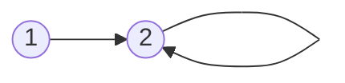
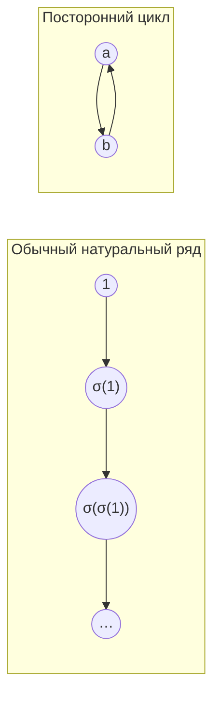

# Отображения. Множество натуральных чисел. Математическая индукция. Мощность множеств

## План лекции

1. Классификация отображений, обратное отображение и его построение.
2. Построение множества натуральных чисел (аксиоматика Пеано).
3. Методы математической индукции, свойства натурального ряда.
4. Мощность множеств: равномощность, счётные множества, теорема Кантора — Бернштейна.

---

## 1. Классификация отображений

Пусть даны два множества $A$ и $B$, и $f: A \to B$ — **отображение**, то есть правило, которое каждому элементу $x \in A$ ставит в соответствие **ровно один** элемент $f(x) \in B$.

Множество $A$ называют областью определения, множество $B$ — областью прибытия. Отображения различают по тому, насколько «аккуратно» они связывают элементы $A$ и $B$. Для этого вводятся три понятия: инъекция, сюръекция и биекция.

### 1.1. Определение 1 (инъективное отображение)

:::meaning
Отображение $f: A \to B$ называется **инъективным** (*инъекция*, *мономорфизм*), если разным элементам $A$ соответствуют разные элементы $B$:

$$
\forall x_1, x_2 \in A:\quad x_1 \neq x_2 \;\Rightarrow\; f(x_1) \neq f(x_2).
$$
:::

Эту же мысль можно записать через отрицание (контрапозиция) — в таком виде определение удобнее использовать в доказательствах:

$$
f(x_1) = f(x_2) \;\Rightarrow\; x_1 = x_2 .
$$

Инъективность означает, что отображение «не склеивает» точки: два разных элемента области определения никогда не попадают в одну и ту же точку области прибытия.

:::example
**Как доказывают инъективность на практике.** Берут произвольные $x_1, x_2 \in A$ с равенством $f(x_1) = f(x_2)$ и, пользуясь конкретным видом $f$, выводят из него $x_1 = x_2$. Именно эта схема используется ниже, например, в разделах 3.3 и 7.5.
:::

:::warning
**Частая ошибка — перепутать направление импликации.** Инъективность — это именно утверждение «из равенства образов следует равенство прообразов»:
$$
f(x_1) = f(x_2) \Rightarrow x_1 = x_2 .
$$
Обратная импликация $x_1 = x_2 \Rightarrow f(x_1) = f(x_2)$ верна **для любого** отображения (ведь $f$ — функция, и каждому $x$ отвечает одно значение), поэтому она ничего не говорит об инъективности.
:::

```graph directed
title: Инъекция: разные элементы идут в разные (но $B$ может быть «шире»)
caption: Схематический пример. Элемент d не является ничьим образом — для инъекции это допустимо.
layout: manual
A1 "1"
A2 "2"
A3 "3"
B1 "a"
B2 "b"
B3 "c"
B4 "d"
A1 @ 160, 50
A2 @ 160, 130
A3 @ 160, 210
B1 @ 480, 30
B2 @ 480, 100
B3 @ 480, 170
B4 @ 480, 240
A1 -> B1
A2 -> B2
A3 -> B3
```

### 1.2. Определение 2 (сюръективное отображение)

:::meaning
Отображение $f: A \to B$ называется **сюръективным** (*сюръекция*, *эпиморфизм*), если каждый элемент $B$ является образом хотя бы одного элемента $A$:

$$
\forall y \in B \;\; \exists x \in A: \; f(x) = y,
$$

или, короче,

$$
B = f(A).
$$
:::

Сюръективность означает, что отображение «накрывает» всё множество $B$. Прообраз не обязан быть единственным — достаточно, чтобы он существовал.

Запись $B = f(A)$ читается так: множество всех образов $f(A) = \{ f(x) : x \in A \}$ (область значений, или образ множества $A$) совпадает со всем множеством $B$.

:::warning
**Сюръективность зависит от выбора области прибытия $B$.** Одна и та же «формула» может задавать сюръективное отображение $A \to f(A)$, но не быть сюръективной как отображение $A \to B$, если $B \supsetneq f(A)$ (то есть в $B$ есть элементы, не попавшие в образ).
:::

```graph directed
title: Сюръекция: каждый элемент $B$ получен, но прообразы могут повторяться
caption: Схематический пример. Элементы 1 и 2 переходят в один и тот же элемент a — для сюръекции это допустимо.
layout: manual
A1 "1"
A2 "2"
A3 "3"
A4 "4"
B1 "a"
B2 "b"
B3 "c"
A1 @ 160, 30
A2 @ 160, 100
A3 @ 160, 170
A4 @ 160, 240
B1 @ 480, 60
B2 @ 480, 135
B3 @ 480, 210
A1 -> B1
A2 -> B1
A3 -> B2
A4 -> B3
```

### 1.3. Определение 3 (биективное отображение)

:::meaning
Отображение $f: A \to B$ называется **биективным** (*биекция*, *взаимно однозначное соответствие*), если оно одновременно **сюръективно и инъективно**.
:::

Биекция устанавливает полное взаимно однозначное соответствие между $A$ и $B$: каждому элементу $A$ отвечает ровно один элемент $B$, и, наоборот, каждый элемент $B$ является образом ровно одного элемента $A$. При этом:

- **единственность** прообраза следует из инъективности;
- **существование** прообраза следует из сюръективности.

:::remember
Именно наличие биекции лежит в основе понятия «равной мощности» множеств (см. раздел 7).
:::

```graph directed
title: Биекция: соответствие «один к одному» в обе стороны
caption: Схематический пример.
layout: manual
A1 "1"
A2 "2"
A3 "3"
B1 "a"
B2 "b"
B3 "c"
A1 @ 160, 50
A2 @ 160, 130
A3 @ 160, 210
B1 @ 480, 50
B2 @ 480, 130
B3 @ 480, 210
A1 -> B2
A2 -> B1
A3 -> B3
```

---

## 2. Композиция отображений

### 2.1. Определение 4

Пусть $f: X \to Y$ и $g: Y \to Z$ — два отображения. Важно: **область прибытия первого совпадает с областью определения второго**.

:::meaning
**Композицией** отображений $f$ и $g$ называется отображение
$$
g \circ f : X \to Z,
$$
определяемое равенством
$$
(g \circ f)(x) = g\bigl(f(x)\bigr), \qquad x \in X.
$$
:::

Композиция — это операция над отображениями: она берёт два отображения и производит из них третье.

:::warning
**Порядок применения обратен порядку записи.** В записи $g \circ f$ первой стоит буква $g$, но применяется **сначала $f$, затем $g$**: берём $x$, находим $f(x) \in Y$, а потом применяем $g$ к этому результату. Это частый источник ошибок при первом знакомстве с композицией.
:::

```diagram
title: Композиция — последовательное применение
A: round "x ∈ X"
B: round "f(x) ∈ Y"
C: round "g(f(x)) ∈ Z"
A -> B : f
B -> C : g
```

### 2.2. Свойство: ассоциативность композиции

:::remember
**Теорема.** Для любых отображений $f: X \to Y$, $g: Y \to Z$, $h: Z \to W$ выполняется
$$
h \circ (g \circ f) = (h \circ g) \circ f .
$$
:::

Это означает, что композицию можно записывать **без скобок**: $h \circ g \circ f$ — результат не зависит от способа расстановки скобок.

:::example
**Разбор доказательства.** Чтобы доказать равенство двух отображений $X \to W$, нужно показать, что они дают одинаковый результат на произвольном элементе $x \in X$. Введём обозначения для промежуточных значений:

- $y = f(x) \in Y$;
- $z = g(y) = g(f(x)) \in Z$;
- $w = h(z) \in W$.

**Левая часть** $h \circ (g \circ f)$. Сначала вычисляем внутреннюю композицию: $(g \circ f)(x) = g(f(x)) = g(y) = z$. Затем применяем $h$:
$$
\bigl(h \circ (g \circ f)\bigr)(x) = h\bigl((g \circ f)(x)\bigr) = h(z) = w .
$$

**Правая часть** $(h \circ g) \circ f$. Сначала $f(x) = y$, затем применяем композицию $h \circ g$ к $y$, причём $(h \circ g)(y) = h(g(y)) = h(z) = w$:
$$
\bigl((h \circ g) \circ f\bigr)(x) = (h \circ g)\bigl(f(x)\bigr) = (h \circ g)(y) = w .
$$

Обе части равны одному и тому же элементу $w \in W$ для произвольного $x \in X$, следовательно, отображения совпадают. $\blacksquare$
:::

:::note
По сути, оба способа расстановки скобок описывают одну и ту же цепочку применений
$$
x \xrightarrow{\,f\,} y \xrightarrow{\,g\,} z \xrightarrow{\,h\,} w .
$$
Ассоциативность возникает естественно из самого определения композиции как подстановки одной функции в другую.
:::

```diagram
title: Цепочка $x \to y \to z \to w$
A: round "x ∈ X"
B: round "y = f(x) ∈ Y"
C: round "z = g(y) ∈ Z"
D: round "w = h(z) ∈ W"
A -> B : f
B -> C : g
C -> D : h
```

---

## 3. Обратимость отображений

### 3.1. Определение 5 (тождественное отображение)

:::meaning
Отображение $\mathrm{id}_X : X \to X$ называется **тождественным**, если
$$
\mathrm{id}_X(x) = x \qquad \forall x \in X,
$$
то есть оно переводит каждый элемент в самого себя.
:::

### 3.2. Определение 6 (обратное отображение)

:::meaning
Пусть $f: X \to Y$. Отображение $g: Y \to X$ называется **обратным** к $f$, если одновременно
$$
f \circ g = \mathrm{id}_Y \qquad \text{и} \qquad g \circ f = \mathrm{id}_X .
$$
В этом случае пишут $g = f^{-1}$.
:::

Требуются **оба** равенства сразу:

- $g \circ f = \mathrm{id}_X$ означает, что применение $f$, а затем $g$ возвращает исходный элемент $x$ — то есть $g$ «откатывает» действие $f$ на всей области $X$;
- $f \circ g = \mathrm{id}_Y$ означает то же самое в обратную сторону: применение $g$, а затем $f$ к любому $y \in Y$ возвращает $y$.

Именно потому, что нужны оба условия одновременно, обратимость — сильное требование, равносильное биективности (см. теорему ниже). Отображение и его обратное определены неразрывно: говоря «обратное отображение», мы автоматически утверждаем его существование.

```diagram
title: Отображение и обратное к нему
A: box "X"
B: box "Y"
A -> B : f
B -> A : f⁻¹
```

### 3.3. Теорема (критерий обратимости)

:::remember
**Теорема.** Пусть $f: X \to Y$. Тогда
$$
f \text{ обратимо} \iff f \text{ является биекцией.}
$$
:::

#### 3.3.1. Доказательство, часть 1: ($\Rightarrow$) если $f$ обратимо, то $f$ — биекция

Пусть $f$ обратимо и $g = f^{-1}$, то есть $f \circ g = \mathrm{id}_Y$ и $g \circ f = \mathrm{id}_X$. Нужно проверить два свойства: инъективность и сюръективность.

:::example
**1) Инъективность $f$.** Пусть $f(x_1) = f(x_2)$. Применим отображение $g = f^{-1}$ к обеим частям равенства:
$$
g\bigl(f(x_1)\bigr) = g\bigl(f(x_2)\bigr)
\iff (g \circ f)(x_1) = (g \circ f)(x_2)
\iff \mathrm{id}_X(x_1) = \mathrm{id}_X(x_2)
\iff x_1 = x_2 .
$$
Из $f(x_1) = f(x_2)$ получили $x_1 = x_2$ — это в точности определение инъективности. $\blacksquare$

**2) Сюръективность $f$.** Пусть $y \in Y$ — произвольный элемент. Положим $x = f^{-1}(y) = g(y) \in X$. Тогда, используя $f \circ g = \mathrm{id}_Y$, получаем
$$
f(x) = f\bigl(f^{-1}(y)\bigr) = (f \circ g)(y) = \mathrm{id}_Y(y) = y .
$$
Значит, $y = f(x)$: для произвольного $y \in Y$ нашёлся прообраз $x \in X$ — это и есть сюръективность. $\blacksquare$
:::

Из пунктов 1) и 2) следует, что $f$ — биекция.

#### 3.3.2. Доказательство, часть 2: ($\Leftarrow$) если $f$ — биекция, то $f$ обратимо

Пусть $f$ биективно. Нужно построить отображение $g: Y \to X$ такое, что
$$
f(x) = y \iff g(y) = x,
$$
проверить, что оно корректно определено (является функцией), и что выполняются оба равенства из определения 6.

:::example
**Построение $g$.** Возьмём произвольный $y \in Y$.

- Так как $f$ **сюръективно**, для этого $y$ найдётся хотя бы один $x \in X$ с $f(x) = y$. Значит, $g(y)$ можно задать для **любого** $y \in Y$: область определения $g$ — всё $Y$.
- Так как $f$ **инъективно**, такой $x$ **единственный**. Его и обозначим $x = g(y)$.

Итак, инъективность гарантирует **однозначность** значения $g(y)$ (иначе $g$ не было бы функцией — одному $y$ соответствовало бы несколько $x$), а сюръективность гарантирует, что $g(y)$ **определено** для каждого $y \in Y$.

**Проверка равенств.**

- Пусть $x \in X$ и $y = f(x)$. По построению $g$, значение $g(y)$ — это тот самый единственный прообраз $y$, то есть $x$. Поэтому $g(f(x)) = g(y) = x$, то есть $g \circ f = \mathrm{id}_X$. $\blacksquare$
- Пусть $y \in Y$ и $x = g(y)$. По построению $x$ выбран так, что $f(x) = y$. Поэтому $f(g(y)) = f(x) = y$, то есть $f \circ g = \mathrm{id}_Y$. $\blacksquare$

Следовательно, $g$ — обратное отображение к $f$, то есть $f$ обратимо. $\blacksquare$
:::

:::remember
**Итог.** «Обратимое отображение» и «биекция» — два эквивалентных описания одного и того же свойства:

- обратимость — это *существование обратного отображения*;
- биективность — *структурное свойство* (инъективность + сюръективность).

Теорема утверждает их равносильность и заодно даёт явный способ построения $f^{-1}$: $f^{-1}(y)$ — это единственный прообраз точки $y$.
:::

---

## 4. Множество $\mathbb{N}$. Аксиоматика Пеано

### 4.1. Определение натурального числа

Пусть $\mathbb{N}$ — непустое множество, на котором задано отображение
$$
\sigma : \mathbb{N} \to \mathbb{N},
$$
называемое **отображением следования**. Запись $\sigma(n)$ читается как «число, следующее за $n$».

:::meaning
**Определение 7.** Множество $\mathbb{N}$ с выделенным элементом $1$ и отображением $\sigma$ называется **натуральным рядом**, если выполнены пять аксиом (**аксиомы Пеано**).
:::

#### 4.1.1. Аксиомы Пеано

:::remember
**Аксиома 1.** $1 \in \mathbb{N}$. В множестве есть выделенный «начальный» элемент.

**Аксиома 2 (замкнутость относительно следования).**
$$
\forall n \in \mathbb{N}: \; \sigma(n) \in \mathbb{N}.
$$
У каждого натурального числа есть «следующее за ним» натуральное число — операция $\sigma$ не выводит из $\mathbb{N}$.

**Аксиома 3 (несюръективность $\sigma$).**
$$
\forall n \in \mathbb{N}: \; \sigma(n) \neq 1.
$$
Единица не является следующей ни для какого числа, то есть у $1$ нет предшественника. Отображение $\sigma$ не сюръективно: значение $1$ никогда не достигается.

**Аксиома 4 (инъективность $\sigma$).**
$$
\forall n_1, n_2 \in \mathbb{N}: \; n_1 \neq n_2 \;\Rightarrow\; \sigma(n_1) \neq \sigma(n_2).
$$
Разные числа имеют разных «последователей»; иначе говоря, каждое число (кроме $1$) следует ровно за одним числом.

**Аксиома 5 (аксиома индукции).** Не существует собственного подмножества $M \subsetneq \mathbb{N}$, которое содержит $1$ и замкнуто относительно $\sigma$.
:::

Эквивалентная и более употребительная формулировка аксиомы 5:

$$
\forall M \subseteq \mathbb{N}: \quad
\Bigl[\, (1 \in M) \wedge \bigl(\forall n \in M: \sigma(n) \in M\bigr) \Bigr] \;\Rightarrow\; M = \mathbb{N}.
$$

:::meaning
**Смысл аксиомы индукции.** $\mathbb{N}$ — это *наименьшее* множество, которое содержит $1$ и замкнуто относительно $\sigma$. В $\mathbb{N}$ нет «лишних» элементов сверх тех, что получаются из $1$ последовательным применением $\sigma$:
$$
1,\ \sigma(1),\ \sigma(\sigma(1)),\ \dots
$$
Именно эта аксиома делает возможным метод математической индукции (см. далее).
:::

```graph directed
title: Натуральный ряд: единица и последовательное применение $\sigma$
caption: У единицы нет предшественника (аксиома 3); каждое число имеет ровно одного последователя (аксиомы 2 и 4).
layout: manual
N1 "1"
N2 "σ(1)"
N3 "σ(σ(1))"
N4 "σ(σ(σ(1)))"
N5 "…"
N1 @ 60, 60
N2 @ 190, 60
N3 @ 320, 60
N4 @ 470, 60
N5 @ 600, 60
N1 -> N2 : σ
N2 -> N3 : σ
N3 -> N4 : σ
N4 -> N5 : σ
```

:::note
Число $\sigma(n)$ принято обозначать $n + 1$. Так, в определении сложения ниже правило «$m + 1 = \sigma(m)$» как раз и означает, что $+1$ — это применение $\sigma$.
:::

### 4.2. Зачем нужна каждая аксиома: примеры «поломки»

Полезно понимать, что произойдёт, если убрать одну из аксиом: тогда множество $\{1, 2, 3, \dots\}$ перестаёт однозначно описываться оставшимися аксиомами, и появляются «лишние» модели.

:::example
**Если убрать аксиому 4 (инъективность $\sigma$).**

Возьмём $M = \{1, 2\}$ с $\sigma(1) = 2$, $\sigma(2) = 2$. Проверим аксиомы:

1. $1 \in M$ — выполнено.
2. $\sigma$ не выводит из $M$ — выполнено.
3. $\sigma(n) \neq 1$ для обоих элементов — выполнено.
4. Аксиома 4 **нарушена**: $1 \neq 2$, однако $\sigma(1) = \sigma(2) = 2$ — два разных элемента «сливаются» в одного последователя.

Без требования инъективности такое конечное множество с «застрявшим» элементом $2$ (для него $\sigma(2) = 2$) формально удовлетворяло бы остальным аксиомам, что противоречит нашему представлению о натуральном ряде как о бесконечной последовательности без зацикливаний.


:::

:::example
**Если убрать аксиому 5 (аксиому индукции).**

Возьмём $M = \mathbb{N} \cup \{a, b\}$, где $a, b$ — два новых элемента, не входящих в обычный натуральный ряд, и положим $\sigma(a) = b$, $\sigma(b) = a$.

Первые четыре аксиомы здесь выполняются (в частности, $\sigma$ инъективно и $\sigma(n) \neq 1$ для всех $n$), но появляется «посторонний» цикл $a \to b \to a \to \dots$, никак не связанный с $1$ и обычными числами. Аксиома индукции как раз запрещает такие «лишние» элементы: она гарантирует, что в $\mathbb{N}$ нет ничего, кроме результатов повторного применения $\sigma$ к $1$.


:::

---

## 5. Принцип математической индукции

### 5.1. Теорема (классический принцип математической индукции, ММИ)

Пусть $P(n)$ — некоторое утверждение, зависящее от $n \in \mathbb{N}$.

:::remember
**Теорема (ММИ).** Утверждение $P(n)$ истинно для всех $n \in \mathbb{N}$, если выполнены два условия:

1. **База индукции:** $P(1)$ истинно.
2. **Индукционный переход:** $\forall n \in \mathbb{N}: \; P(n) = 1 \Rightarrow P(n+1) = 1$, то есть из истинности $P(n)$ следует истинность $P(n+1)$.
:::

Запись $P(n) = 1$ — это способ сказать «$P(n)$ истинно», по аналогии с булевыми значениями «истина / ложь».

#### 5.1.1. Доказательство

Рассмотрим множество всех натуральных чисел, для которых утверждение истинно:
$$
M = \{\, n \in \mathbb{N} \mid P(n) = 1 \,\} \subseteq \mathbb{N}.
$$
Наша цель — показать, что $M = \mathbb{N}$: это и будет означать, что $P(n)$ истинно для всех $n$.

Проверим, что $M$ удовлетворяет условию аксиомы индукции (аксиомы 5):

- по базе индукции $P(1)$ истинно, значит $1 \in M$;
- по индукционному переходу, если $n \in M$ (то есть $P(n)$ истинно), то $P(n+1)$ истинно, то есть $\sigma(n) = n + 1 \in M$.

Таким образом, $M$ содержит $1$ и замкнуто относительно $\sigma$. По аксиоме индукции отсюда следует $M = \mathbb{N}$, то есть $P(n)$ истинно для всех $n \in \mathbb{N}$. $\blacksquare$

:::meaning
**Ключевая идея.** Принцип математической индукции — это не отдельная аксиома, а прямое логическое следствие аксиомы 5. Доказательство «по индукции» — это в точности проверка того, что множество «хороших» чисел (тех, для которых утверждение верно) совпадает со всем $\mathbb{N}$, с использованием минимальности $\mathbb{N}$.
:::

```diagram
title: Логика принципа индукции
A: box "База: P(1) истинно"
B: box "Переход: P(n) ⇒ P(n+1)"
C: box "M = {n | P(n) истинно}: 1 ∈ M и σ(n) ∈ M"
D: box "Аксиома индукции: M = N"
E: round "P(n) истинно для всех n"
A -> C
B -> C
C -> D
D -> E
```

### 5.2. Сложение и умножение в $\mathbb{N}$

Пользуясь только аксиомами Пеано и функцией следования $\sigma$, можно **рекурсивно** построить арифметические операции. Рекурсия означает, что значение операции на $n+1$ определяется через её значение на $n$.

### 5.3. Определение 8 (сложение)

:::meaning
**Сложением** ($+$) в $\mathbb{N}$ называется бинарная операция, задаваемая рекурсивно двумя правилами:

1. $m + 1 = \sigma(m)$ — прибавление $1$ к $m$ по определению есть следующий за $m$ элемент;
2. $m + \sigma(n) = \sigma(m + n)$ — прибавление «следующего за $n$» числа сводится к прибавлению $n$ и последующему переходу к следующему элементу.
:::

Второе правило позволяет вычислить сумму $m + k$ для любого $k$, «спускаясь» от $k$ вниз до $1$ шаг за шагом и каждый раз пользуясь уже известным значением суммы для меньшего слагаемого.

:::example
**Как работает рекурсия.** Для слагаемого $\sigma(\sigma(1))$ шаг за шагом получаем:
$$
m + \sigma(\sigma(1))
= \sigma\bigl(m + \sigma(1)\bigr)
= \sigma\bigl(\sigma(m + 1)\bigr)
= \sigma\bigl(\sigma(\sigma(m))\bigr).
$$
На каждом шаге слагаемое «уменьшается» на один применённый $\sigma$, пока не дойдём до $m + 1 = \sigma(m)$.
:::

:::note
Для сложения верно также равенство $\sigma(m) + n = \sigma(m + n)$: оператор $\sigma$ можно «проносить» через сложение, и слева, и справа. Поэтому значение можно записать цепочкой
$$
m + \sigma(n) = \sigma(m) + n = \sigma(m + n).
$$
Первое равенство цепочки — не часть определения, а свойство сложения, которое доказывается индукцией по $n$.
:::

### 5.4. Определение 9 (умножение)

:::meaning
**Произведением** ($\cdot$) в $\mathbb{N}$ называется операция, задаваемая рекурсивно:

1. $m \cdot 1 = m$;
2. $m \cdot \sigma(n) = m + m \cdot n$.
:::

Умножение на $1$ ничего не меняет (база рекурсии), а умножение на «следующее» число $\sigma(n)$ сводится к прибавлению ещё одного слагаемого $m$ к уже известному произведению $m \cdot n$. Так формализуется привычная идея «умножение — это повторное сложение».

### 5.5. Отношение порядка на $\mathbb{N}$

На множестве $\mathbb{N}$ вводится отношение линейного порядка. **Строгий** линейный порядок $<$ задаётся условием

$$
n < m \iff \exists\, k \in \mathbb{N}: \; m = n + k .
$$

Число $n$ меньше числа $m$ тогда и только тогда, когда до $m$ можно «дойти» от $n$, прибавив некоторое натуральное $k$, то есть $m$ получается из $n$ прибавлением положительной «разности» $k$.

Нестрогое неравенство $n \le m$ означает $(n < m) \vee (n = m)$.

---

## 6. Вторая лекция: вполне упорядоченность $\mathbb{N}$ и применения индукции

### 6.1. Теорема о полной упорядоченности множества $\mathbb{N}$ (принцип наименьшего числа)

:::remember
**Теорема.**
$$
\forall A \subseteq \mathbb{N},\ A \neq \varnothing \quad \exists\, a_0 \in A: \quad \forall a \in A \;\; a_0 \le a .
$$
Здесь $a_0 \le a$ понимается как $(a_0 < a) \vee (a_0 = a)$.
:::

В любом непустом подмножестве $\mathbb{N}$ существует **наименьший элемент**. Это свойство называют **полной (вполне) упорядоченностью** $\mathbb{N}$.

:::note
Этим свойством обладает не всякое линейно упорядоченное множество. Например, в множестве положительных рациональных чисел наименьшего элемента нет.
:::

#### 6.1.1. Доказательство (от противного)

Пусть $A \subseteq \mathbb{N}$, $A \neq \varnothing$, и предположим противное: в $A$ **нет** наименьшего элемента. Это значит (отрицание утверждения теоремы):
$$
\forall a_0 \in A \;\; \exists a \in A: \; a_0 > a,
$$
то есть для любого элемента $A$ всегда найдётся элемент $A$ ещё меньше него.

Рассмотрим вспомогательное множество
$$
M = \{\, n \in \mathbb{N} \mid \forall a \in A: \; n < a \,\}
$$
— множество всех чисел, меньших **любого** элемента $A$ («строгие нижние границы» $A$).

:::note
В доказательстве используются два свойства порядка, которые выводятся из определений сложения и порядка:

- $1 \le a$ для любого $a \in \mathbb{N}$;
- если $n < a$, то $n + 1 \le a$ (между $n$ и $n + 1$ нет натуральных чисел).
:::

:::example
**Шаг 1: $1 \in M$.** Для любого $a \in A$ выполнено $1 \le a$. Если бы $1 = a$ для некоторого $a \in A$, то этот элемент был бы наименьшим в $A$ (так как $1 \le a'$ для всех $a'$) — противоречие с предположением. Значит, $1 < a$ для всех $a \in A$, то есть $1 \in M$.

**Шаг 2: если $n \in M$, то $n + 1 \in M$.** Пусть $n < a$ для всех $a \in A$. Тогда $n + 1 \le a$ для всех $a \in A$. Если бы $n + 1 = a_0$ для некоторого $a_0 \in A$, то $a_0 \le a$ для всех $a \in A$, то есть $a_0$ — наименьший элемент $A$, что противоречит предположению. Значит, $n + 1 < a$ для всех $a \in A$, то есть $n + 1 = \sigma(n) \in M$.

**Шаг 3: $M = \mathbb{N}$.** Из шагов 1 и 2 по аксиоме индукции получаем $M = \mathbb{N}$.

**Шаг 4: противоречие.** Так как $A \neq \varnothing$, возьмём любой $a \in A$. Поскольку $a \in \mathbb{N} = M$, то $a < a'$ для всех $a' \in A$, в частности $a < a$. Но строгое неравенство $a < a$ невозможно. Получили противоречие.
:::

Полученное противоречие показывает, что исходное предположение неверно. Значит, в $A$ обязательно существует наименьший элемент $a_0$. $\blacksquare$

:::meaning
**Суть доказательства.** Предположение «наименьшего элемента нет» вместе с аксиомой индукции приводит к тому, что *каждое* натуральное число меньше всех элементов $A$, а значит, $A$ не может содержать ни одного элемента, то есть $A = \varnothing$ — что противоречит условию $A \neq \varnothing$.
:::

### 6.2. Сильный принцип математической индукции

В отличие от классического ММИ, где переход использует истинность только **предыдущего** утверждения $P(n)$, в сильном ММИ индукционный переход опирается на **все предыдущие шаги сразу**.

:::remember
**Теорема (сильный ММИ).** Утверждение $P(n)$ истинно для всех $n \in \mathbb{N}$, если:

1. $P(1)$ истинно;
2. если $P(1), P(2), \dots, P(n)$ все истинны, то $P(n+1)$ истинно.
:::

Сильный ММИ логически равносилен классическому. Его можно вывести из классического, применив тот к утверждению
$$
Q(n) = P(1) \wedge P(2) \wedge \dots \wedge P(n).
$$

:::example
**Как сильный ММИ следует из классического.**

- База: $Q(1) = P(1)$ истинно по условию 1.
- Переход: пусть $Q(n)$ истинно, то есть истинны все $P(1), \dots, P(n)$. По условию 2 истинно и $P(n+1)$, а значит, истинно $Q(n+1) = Q(n) \wedge P(n+1)$.
- По классическому ММИ $Q(n)$ истинно для всех $n$, а $Q(n)$ содержит $P(n)$ как один из членов, поэтому $P(n)$ истинно для всех $n$. $\blacksquare$
:::

На практике сильный ММИ удобнее в тех задачах, где для обоснования шага $n + 1$ нужна информация не только о непосредственно предыдущем шаге $n$, но и о более ранних. Типичный пример — числа Фибоначчи, где $F_n$ выражается сразу через два предыдущих члена.

### 6.3. Примеры применения ММИ

#### 6.3.1. Бином Ньютона

:::formula
$$
(a + b)^n = \sum_{k=0}^{n} C_n^k \, a^{\,n-k} b^{\,k},
\qquad
C_n^k = \frac{n!}{k!\,(n-k)!}.
$$
Здесь $C_n^k$ — число сочетаний («биномиальные коэффициенты»).
:::

Коэффициенты $C_n^k$ образуют **треугольник Паскаля**; его начало:

$$
\begin{array}{ccccccccc}
 & & & & 1 & & & & \\
 & & & 1 & & 1 & & & \\
 & & 1 & & 2 & & 1 & & \\
 & 1 & & 3 & & 3 & & 1 & \\
1 & & 4 & & 6 & & 4 & & 1
\end{array}
$$

Каждая строка получается из предыдущей: крайние элементы равны $1$, а каждый внутренний элемент — сумма двух стоящих над ним чисел. Это соответствует тождеству

:::formula
$$
C_n^k = C_{n-1}^{k-1} + C_{n-1}^{k},
$$
которое используется при доказательстве формулы бинома по индукции.
:::

Формула бинома Ньютона доказывается по ММИ по $n \in \mathbb{N}$.

:::example
**Схема доказательства.**

**База** ($n = 1$; можно также взять $n = 0$): 
$$
(a + b)^1 = a + b = C_1^0\, a + C_1^1\, b .
$$

**Переход.** Пусть формула верна для $n$. Домножим обе части на $(a + b)$:
$$
(a+b)^{n+1} = \sum_{k=0}^{n} C_n^k\, a^{\,n+1-k} b^{\,k} \;+\; \sum_{k=0}^{n} C_n^k\, a^{\,n-k} b^{\,k+1}.
$$
Во второй сумме заменим индекс $k+1 \to k$ (тогда $k$ пробегает значения от $1$ до $n+1$):
$$
\sum_{k=1}^{n+1} C_n^{k-1}\, a^{\,n+1-k} b^{\,k}.
$$
Теперь обе суммы содержат одинаковые степени $a^{\,n+1-k} b^{\,k}$, поэтому их коэффициенты складываются. Считая $C_n^{-1} = C_n^{n+1} = 0$, получаем
$$
(a+b)^{n+1} = \sum_{k=0}^{n+1} \bigl(C_n^{k} + C_n^{k-1}\bigr)\, a^{\,n+1-k} b^{\,k}
= \sum_{k=0}^{n+1} C_{n+1}^{k}\, a^{\,n+1-k} b^{\,k},
$$
где последнее равенство — это тождество для биномиальных коэффициентов (с $n+1$ на месте $n$). Это и есть формула для $n + 1$. $\blacksquare$
:::

#### 6.3.2. Числа Фибоначчи

:::formula
$$
F_1 = 1, \qquad F_2 = 1, \qquad F_n = F_{n-1} + F_{n-2} \quad (n \ge 3,\ n \in \mathbb{N}).
$$
:::

Каждое число ряда, начиная с третьего, явно определяется через два предыдущих; например, $F_3 = F_2 + F_1 = 2$. Поэтому свойства чисел Фибоначчи естественно доказывать по ММИ по $\mathbb{N}$.

:::note
Чаще всего здесь нужна именно **сильная** форма индукции: чтобы обосновать шаг для $F_{n+1}$, приходится опираться сразу на два предыдущих утверждения — для $F_n$ и для $F_{n-1}$, а не только на одно непосредственно предшествующее.
:::

---

## 7. Мощность множества

### 7.1. Определение 10 (равномощность)

:::meaning
Множества $X$ и $Y$ называются **равномощными**, если существует биекция $X$ на $Y$. Это записывается как $X \sim Y$.
:::

### 7.2. Определение 11 (мощность)

:::meaning
**Мощность** множества — это название класса всех множеств, равномощных данному, которому оно принадлежит. Обозначается $|X|$; запись $|X| = |Y|$ означает, что $X$ и $Y$ равномощны (принадлежат одному классу).
:::

Мощность — это обобщение понятия «количество элементов» на произвольные (в том числе бесконечные) множества. Два множества считаются «одинаковыми по размеру», если между ними можно установить биекцию, то есть взаимно однозначно сопоставить элементы одного элементам другого.

### 7.3. Свойства отношения равномощности

Отношение $\sim$ является **отношением эквивалентности**, то есть обладает тремя свойствами.

1. **Рефлексивность:** $X \sim X$ для любого множества $X$ (тождественное отображение $\mathrm{id}_X$ — биекция $X$ на себя).
2. **Симметричность:** $X \sim Y \Rightarrow Y \sim X$. Если $\varphi: X \to Y$ — биекция, то $\varphi^{-1}: Y \to X$ также биекция по теореме о критерии обратимости (раздел 3.3).
3. **Транзитивность:** $X \sim Y,\ Y \sim Z \Rightarrow X \sim Z$. Композиция биекций является биекцией; это следует из того, что композиция инъекций инъективна, а композиция сюръекций сюръективна.

### 7.4. Счётные множества

### 7.5. Определение 12

:::meaning
Множество $A$ называется **счётным**, если $A \sim \mathbb{N}$, то есть элементы $A$ можно занумеровать натуральными числами:
$$
A = \{a_1, a_2, a_3, \dots\}.
$$
:::

Мощность множества $\mathbb{N}$ обозначается
$$
|\mathbb{N}| = \aleph_0
$$
(«алеф-нуль») — это наименьшая бесконечная мощность.

#### 7.5.1. Пример 1. Парадокс Дедекинда: $\mathbb{N} \sim 2\mathbb{N}$

Пусть $2\mathbb{N} = \{2, 4, 6, \dots\}$ — множество чётных натуральных чисел, а $\mathbb{N} = \{1, 2, 3, \dots\}$. Рассмотрим отображение
$$
\varphi : \mathbb{N} \to 2\mathbb{N}, \qquad \varphi(n) = 2n .
$$

```graph directed
title: $\varphi(n) = 2n$ — биекция $\mathbb{N}$ на чётные числа
caption: Схема показывает начало соответствия; далее оно продолжается тем же образом.
layout: manual
T1 "1"
T2 "2"
T3 "3"
T4 "4"
T5 "5"
B1 "2"
B2 "4"
B3 "6"
B4 "8"
B5 "10"
T1 @ 100, 50
T2 @ 210, 50
T3 @ 320, 50
T4 @ 430, 50
T5 @ 540, 50
B1 @ 100, 200
B2 @ 210, 200
B3 @ 320, 200
B4 @ 430, 200
B5 @ 540, 200
T1 -> B1
T2 -> B2
T3 -> B3
T4 -> B4
T5 -> B5
```

:::example
**Проверка, что $\varphi$ — биекция.**

- **Инъективность:** если $2n_1 = 2n_2$, то $n_1 = n_2$.
- **Сюръективность:** для любого чётного числа $2k \in 2\mathbb{N}$ найдётся прообраз $n = k \in \mathbb{N}$, для которого $\varphi(k) = 2k$.

Следовательно,
$$
\mathbb{N} \sim 2\mathbb{N},
$$
то есть множество всех натуральных чисел равномощно своей **собственной части** — чётным числам.
:::

:::meaning
**Почему это «парадокс».** Для конечных множеств собственное подмножество всегда содержит строго меньше элементов, чем всё множество. Пример показывает, что для бесконечных множеств это интуитивное правило перестаёт работать: бесконечное множество может быть равномощно своему собственному подмножеству. Более того, именно это свойство (равномощность собственному подмножеству) часто берут в качестве определения бесконечного множества.
:::

#### 7.5.2. Пример 2. $(0; 1) \sim (0; +\infty)$

Рассмотрим отображение
$$
\varphi : (0, 1) \to (0, +\infty), \qquad \varphi(x) = \frac{1}{x} - 1 .
$$

Это биекция между открытым единичным интервалом и всей положительной полуосью. При $x \to 0^+$ значение $\varphi(x) \to +\infty$, при $x \to 1^-$ значение $\varphi(x) \to 0^+$, а функция $\varphi$ строго убывает.

```plot
title: $\varphi(x) = \frac{1}{x} - 1$ на интервале $(0, 1)$
x: 0..1.5 y: -1..6 grid
y = 1/x - 1 {color: blue, label: "y = 1/x - 1"}
point (0.5, 1) "φ(1/2) = 1"
x = 1
```

:::example
**Точная проверка биективности.**

- **Инъективность:** если $\dfrac{1}{x_1} - 1 = \dfrac{1}{x_2} - 1$, то $\dfrac{1}{x_1} = \dfrac{1}{x_2}$, откуда $x_1 = x_2$ (это согласуется со строгой монотонностью).
- **Сюръективность:** пусть $y \in (0, +\infty)$. Решим уравнение $\varphi(x) = y$, то есть $\dfrac{1}{x} - 1 = y$. Получаем $x = \dfrac{1}{y + 1}$. Так как $y > 0$, то $y + 1 > 1$, и потому $x \in (0, 1)$; значит, $x$ — подходящий прообраз.

Следовательно, эти два множества равномощны, несмотря на то, что одно из них — ограниченный интервал, а другое — неограниченный луч.
:::

### 7.6. Сравнение мощностей. Теорема Кантора — Бернштейна

### 7.7. Определение 13

:::meaning
$$
|A| \le |B| \iff \text{существует инъективное отображение } A \to B,
$$
$$
|A| \ge |B| \iff \text{существует сюръективное отображение } A \to B.
$$
:::

- Неравенство $|A| \le |B|$ означает, что $A$ можно «вложить» в $B$ без склеивания элементов (инъективно); грубо говоря, элементов в $A$ «не больше», чем в $B$.
- Неравенство $|A| \ge |B|$, заданное через сюръекцию $A \to B$, — двойственное условие: $A$ «достаточно велико», чтобы покрыть собой всё $B$.

### 7.8. Теорема (Кантора — Бернштейна)

:::remember
**Теорема (Кантора — Бернштейна).**
$$
\bigl(|A| \le |B|\bigr) \wedge \bigl(|A| \ge |B|\bigr) \iff |A| = |B| .
$$
:::

Если существуют инъекция $A \to B$ и сюръекция $A \to B$, то $A$ и $B$ обязательно равномощны, то есть между ними существует биекция.

Сюръекция $A \to B$ равносильна инъекции $B \to A$: достаточно для каждого $b \in B$ выбрать один из его прообразов. Поэтому теорему можно читать и так: *если есть инъекции в обе стороны, то есть биекция*.

:::note
**Практическая польза.** Чтобы доказать равномощность двух множеств, часто гораздо проще построить две инъекции (по одной в каждую сторону), чем сразу явно предъявить биекцию.
:::

### 7.9. Пример явного построения биекции: $[0, 1] \to (0, 1)$

Построим биекцию между отрезком $[0, 1]$ (с концами) и интервалом $(0, 1)$ (без концов). «На первый взгляд» эти множества отличаются двумя элементами, но на самом деле они равномощны.

:::formula
$$
F : [0, 1] \to (0, 1), \qquad
F(x) =
\begin{cases}
\dfrac{1}{2}, & x = 0,\\[2mm]
\dfrac{1}{4}, & x = 1,\\[2mm]
\dfrac{1}{2^{\,n+2}}, & x = \dfrac{1}{2^{\,n}},\ n \ge 1,\\[2mm]
x, & \text{иначе.}
\end{cases}
$$
:::

:::meaning
**Идея построения.** Концы отрезка $0$ и $1$ — те два «лишних» элемента, которых нет в $(0, 1)$, поэтому их нельзя отобразить тождественно. Нужно «освободить место» для них внутри интервала. Для этого счётная последовательность точек
$$
1,\ \tfrac{1}{2},\ \tfrac{1}{4},\ \tfrac{1}{8},\ \dots \qquad \left(\tfrac{1}{2^{\,n}},\ n \ge 0\right)
$$
сдвигается на два шага вперёд по самой себе, а все остальные точки остаются на месте:

- $0 \mapsto \dfrac{1}{2}$ (это $\dfrac{1}{2^1}$);
- $1 \mapsto \dfrac{1}{4}$ (это $\dfrac{1}{2^2}$);
- $\dfrac{1}{2^n} \mapsto \dfrac{1}{2^{n+2}}$ для $n \ge 1$ (последовательность $\frac12, \frac14, \frac18, \dots$ сдвигается дальше по себе, освобождая первые два места $\frac12$ и $\frac14$ для образов точек $0$ и $1$);
- все остальные точки $x$, не входящие в счётное множество $\{0\} \cup \{1/2^n : n \ge 0\}$, отображаются сами в себя: $x \mapsto x$.
:::

```graph directed
title: Сдвиг последовательности на два шага
caption: Верхний ряд — точки из [0, 1], нижний — их образы в (0, 1). Каждая стрелка сдвигает точку на два места вправо; многоточие означает продолжение последовательности.
layout: manual
width: 720
height: 320
P0 "0"
P1 "1"
P2 "1/2"
P3 "1/4"
P4 "1/8"
Q2 "1/2"
Q3 "1/4"
Q4 "1/8"
Q5 "1/16"
Q6 "1/32"
P0 @ 50, 70
P1 @ 150, 70
P2 @ 250, 70
P3 @ 350, 70
P4 @ 450, 70
Q2 @ 250, 250
Q3 @ 350, 250
Q4 @ 450, 250
Q5 @ 550, 250
Q6 @ 650, 250
P0 -> Q2 {color: red}
P1 -> Q3 {color: red}
P2 -> Q4
P3 -> Q5
P4 -> Q6
```

:::example
**Почему $F$ — биекция.** Обозначим
$$
S = \{0\} \cup \left\{ \tfrac{1}{2^{\,n}} : n \ge 0 \right\} \subseteq [0, 1], \qquad
T = \left\{ \tfrac{1}{2^{\,m}} : m \ge 1 \right\} \subseteq (0, 1).
$$

1. Пронумеруем элементы $S$ так: $s_0 = 0$, $s_k = \dfrac{1}{2^{\,k-1}}$ при $k \ge 1$ (то есть $s_1 = 1$, $s_2 = \tfrac12$, $s_3 = \tfrac14, \dots$). Тогда по формуле для $F$ получаем $F(s_k) = \dfrac{1}{2^{\,k+1}}$ для всех $k \ge 0$. Значит, $F$ переводит $S$ в $T$ по правилу «$k$-й элемент $\mapsto$ $(k+1)$-й элемент $T$»; это биекция $S \to T$ (сдвиг внутри счётной последовательности происходит взаимно однозначно).
2. На остальных точках $F$ тождественно. Множества $[0, 1] \setminus S$ и $(0, 1) \setminus T$ совпадают: и то и другое — это интервал $(0, 1)$ без точек $\frac{1}{2^n}$, $n \ge 1$. Значит, на этой части $F$ — тождественное отображение множества на само себя.
3. Поскольку $[0, 1] = S \sqcup \bigl([0,1]\setminus S\bigr)$ и $(0, 1) = T \sqcup \bigl((0,1)\setminus T\bigr)$ (объединения непересекающихся множеств), $F$ — биекция на каждой части, а значит, и на всём $[0, 1]$. В частности, образы разных точек различны (инъективность), и каждая точка $(0, 1)$ достигается — либо как образ сдвинутой точки последовательности, либо как неподвижная точка (сюръективность). $\blacksquare$
:::

:::remember
**Общая идея приёма.** Так строят биекцию между множеством и множеством «с добавленным или убранным конечным (или счётным) числом точек»: выделяется счётная подпоследовательность, на которой происходит «сдвиг», а на дополнении к ней отображение остаётся тождественным.
:::

### 7.10. Свойства счётных множеств

1. Любое подмножество счётного множества **либо конечно, либо счётно** (кратко: НБЧС — «не более чем счётно»).
2. Любое **бесконечное** подмножество счётного множества счётно. Это усиление свойства 1 для бесконечного случая: раз подмножество не конечно, то по свойству 1 оно обязано быть счётным.
3. Удаление конечного подмножества из счётного множества не меняет его мощности: оставшееся множество по-прежнему счётно.

:::note
Вместе эти три свойства показывают, что счётность — очень устойчивое свойство: «уменьшение» счётного множества (взятие подмножества, удаление конечной части) либо сохраняет счётность, либо переводит его в конечное множество, но никогда не даёт «промежуточной» мощности между конечной и счётной.
:::

### 7.11. Теорема Кантора (о счётности счётного объединения счётных множеств)

:::remember
**Теорема (Кантор).** Счётное объединение счётных множеств счётно.

То есть если $\{A_k\}_{k=1}^{\infty}$ — счётное семейство множеств, каждое из которых счётно,
$$
A_k = \{a_{k1}, a_{k2}, a_{k3}, \dots\},
$$
то объединение $\bigcup_{k=1}^{\infty} A_k$ также счётно.
:::

#### 7.11.1. Доказательство (диагональный метод Кантора)

Запишем все элементы всех множеств $A_k$ в виде бесконечной таблицы: **номер строки** $k$ — номер множества, **номер столбца** $j$ — номер элемента внутри этого множества:

$$
\begin{array}{cccccc}
a_{11} & a_{12} & a_{13} & a_{14} & \cdots \\
a_{21} & a_{22} & a_{23} & a_{24} & \cdots \\
a_{31} & a_{32} & a_{33} & a_{34} & \cdots \\
a_{41} & a_{42} & a_{43} & a_{44} & \cdots \\
\vdots & \vdots & \vdots & \vdots & \ddots
\end{array}
$$

Таблица бесконечна и вправо, и вниз. Поэтому нельзя просто идти «по строке до конца, потом на следующую строку»: каждая строка сама бесконечна, и до второй строки мы бы никогда не дошли. Вместо этого используется **обход по диагоналям**: элементы группируются по значению суммы индексов $k + j$ (номер строки плюс номер столбца), и внутри каждой такой группы их **конечное число**.

- Диагональ 1: элементы с $k + j = 2$ — только $a_{11}$.
- Диагональ 2: элементы с $k + j = 3$ — это $a_{21}, a_{12}$ (порядок внутри диагонали не важен).
- Диагональ 3: элементы с $k + j = 4$ — это $a_{31}, a_{22}, a_{13}$; и так далее.

Диагональ с $k + j = d$ содержит ровно $d - 1$ элементов, то есть конечное число. Поэтому, последовательно перечисляя диагонали $d = 2, 3, 4, \dots$ и внутри каждой диагонали перечисляя её конечное число элементов, мы получаем **одну общую последовательность**, в которой встречаются абсолютно все элементы всех множеств $A_k$.

```graph directed
title: Обход таблицы по диагоналям
caption: Сплошные синие стрелки — движение внутри диагонали, пунктирные — переход к следующей диагонали. Показаны первые четыре диагонали; таблица продолжается вправо и вниз.
layout: manual
width: 640
height: 320
a11 @ 90, 50
a12 @ 210, 50
a13 @ 330, 50
a14 @ 450, 50
a21 @ 90, 120
a22 @ 210, 120
a23 @ 330, 120
a31 @ 90, 190
a32 @ 210, 190
a41 @ 90, 260
a11 -> a21 {dashed}
a21 -> a12 {color: blue}
a12 -> a31 {dashed}
a31 -> a22 {color: blue}
a22 -> a13 {color: blue}
a13 -> a41 {dashed}
a41 -> a32 {color: blue}
a32 -> a23 {color: blue}
a23 -> a14 {color: blue}
```

Тем самым построена нумерация: элемент за элементом, без пропусков, любой элемент любого $A_k$ рано или поздно встретится на какой-то конечной диагонали. Это даёт сюръекцию $\mathbb{N} \to \bigcup_k A_k$, а после удаления повторов — биекцию $\mathbb{N}$ на всё объединение.

:::warning
**Повторяющиеся элементы.** Если одни и те же элементы встречаются в нескольких множествах $A_k$ одновременно (пересечения множеств непусты), то при обходе такие элементы просто пропускаются при повторном появлении. Это не портит счётность объединения: после удаления повторов каждый элемент остаётся ровно один раз. Получившееся множество — бесконечное подмножество занумерованной последовательности (оно бесконечно, так как содержит бесконечное множество $A_1$), поэтому по свойству 2 из раздела 7.10 оно счётно. $\blacksquare$
:::

:::note
**Следствие.** Тот же диагональный приём лежит в основе доказательства счётности множества рациональных чисел $\mathbb{Q}$: рациональные числа можно представить как объединение счётного числа счётных множеств — для каждого знаменателя $q$ берётся счётное множество дробей $\dfrac{p}{q}$.
:::
