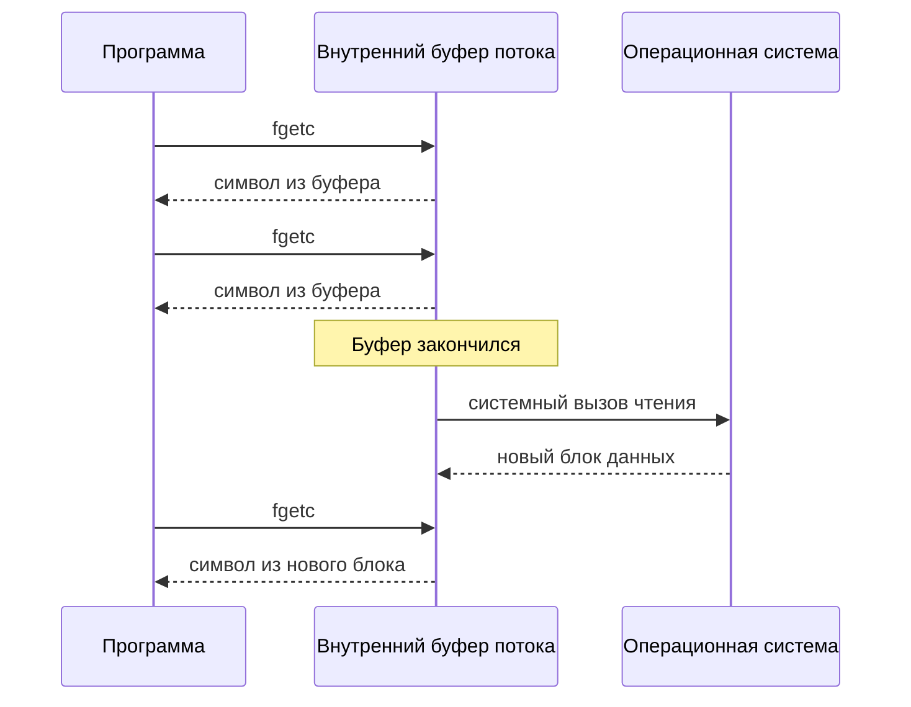

# Работа с файлами в C++: сишный ввод-вывод, буферизация, запись

## Введение: о чём разговор и договорённости

На этом занятии разбирается базовая работа с файлами на C++ (через сишный интерфейс стандартной библиотеки), необходимая для решения первых лабораторных работ, и немного «вглубь» — для тех, кто хочет понимать происходящее под капотом. План:

1. что такое файл с точки зрения программы и как его открыть;
2. посимвольное и буферизированное чтение;
3. сравнение времени работы этих двух способов и объяснение, **почему** получаются именно такие результаты;
4. влияние размера буфера на скорость;
5. перемещение по файлу;
6. запись в файл и обязательное закрытие файла (на примере утилиты копирования).

### Условия, в которых пишется код

Чтобы не собирать проект, программы (файлы `.cpp`) компилируются просто компилятором C++. При этом задаются два вида флагов: флаг выбора **стандарта языка** и флаг **уровня оптимизации**. Ничего сложного в них нет.

:::meaning
**Сишный ввод-вывод (C IO)** — набор функций стандартной библиотеки, доступных и в C++, из заголовка `<cstdio>` (`fopen`, `fgetc`, `fread`, `fputc`, `fwrite`, `fclose` и др.), работающих с файлами через указатель на структуру `FILE`. Он противопоставляется плюсовым потокам (`ifstream`, `ofstream` и т. д.).
:::

:::note
**Почему именно сишный ввод-вывод, а не плюсовые потоки.**

- В первых лабораторных работах требуется использовать обычные массивы: без динамической памяти и без стандартных контейнеров вроде `std::string`.
- Плюсовые потоки очень удобны, но в связке с `std::string` и т. п. Работать с ними через обычные массивы заметно менее удобно.
- Сишный уровень заставляет самостоятельно делать важные вещи, например **закрывать файлы**. Это полезная практика.

Поэтому и на занятии, и в лабораторной рекомендуется использовать именно сишный интерфейс работы с файлами (хотя код пишется на C++).
:::

## Открытие файла: `fopen`

Для открытия файла служит функция `fopen`, определённая в `<cstdio>`. Её сигнатура:

```cpp
FILE* fopen(const char* filename, const char* mode);
```

- Первый параметр — путь к файлу.
- Второй параметр — режим открытия.
- Возвращаемое значение — указатель на `FILE`.

### Параметры

Оба параметра имеют тип `const char*`. Это указатель на первый символ строки; строка в Си — последовательность символов, заканчивающаяся символом `\0`. Следовательно, в `fopen` передаются две обычные сишные строки.

:::warning
Первый параметр называется `filename`, но это **не просто имя файла, а путь к файлу**. Путь может быть:

- **относительным** — отсчитываемым от текущей директории (например, `"main.cpp"`, `"./data.txt"`);
- **абсолютным** — полным путём от корня файловой системы.

Все варианты работают одинаково, если файл по этому пути существует.
:::

**Режим** показывает, как именно открывается файл: на чтение, на запись, на добавление в конец и т. д. Полный список режимов и их подробное описание удобно смотреть на cppreference. В этом занятии используются:

- `"r"` (read) — чтение;
- `"w"` (write) — запись.

### Что возвращает `fopen`

:::meaning
`FILE` — некоторая структура, описывающая открытый файл (поток). Для работы с файлами знать её устройство **не нужно**: достаточно хранить указатель `FILE*`, который вернул `fopen`, и передавать его остальным функциям работы с файлами.
:::

Если файл удалось открыть, возвращается указатель на объект, управляющий открытым потоком. Если открыть файл **не удалось** (например, файла с таким путём нет), возвращается нулевой указатель `NULL`.

:::warning
**Всегда проверяйте результат `fopen`.** Пользователь мог передать любой путь, а файл мог вообще не существовать. Проверка делается через отрицание указателя: нулевой указатель в условии ложен.
:::

```cpp
#include <cstdio>

int main() {
    FILE* file = fopen("data1.txt", "r");   // такого файла нет
    if (!file) {
        printf("No such file\n");
        return 1;
    }
    // ... работа с файлом ...
    fclose(file);
}
```

:::example
Проверка поведения. Пусть рядом с программой лежит файл `data.txt`, а программа пытается открыть `data1.txt`. Тогда:

1. `fopen("data1.txt", "r")` возвращает `NULL`;
2. условие `!file` истинно;
3. программа выводит сообщение об ошибке и завершается.

Если указать существующий файл `data.txt`, условие не сработает, и программа продолжит работу.
:::

## Посимвольное чтение: `fgetc`

Простейший способ чтения — по одному символу функцией `fgetc`:

```cpp
int fgetc(FILE* stream);
```

:::note
На cppreference одна страница описывает `fgetc` и `getc`. Они делают одно и то же — читают следующий символ из потока. Единственное отличие: стандарт разрешает реализовать `getc` как **макрос**, а не как функцию. Пока макросы не изучены, об этом можно не думать: используйте `fgetc`.
:::

### Почему `fgetc` возвращает `int`, а не `char`

Читается один символ, а это ровно один `char`. Но функция возвращает `int`. Причина в том, что нужно уметь вернуть **ещё одно, особое значение — признак того, что читать больше нечего**.

- Если чтение успешно, результатом будет код прочитанного символа (при условии, что он помещается в `char`, это число от $0$ до $255$). Например, символ `a` — это число $97$ (код в таблице ASCII).
- Если чтение не удалось, возвращается константа `EOF` (end of file, «конец файла»).

:::meaning
**`EOF`** — макрос, значение которого здесь $-1$. Число $-1$ **не помещается** в диапазон значений символа ($0\ldots255$), поэтому оно не может быть спутано с настоящим символом. Для хранения и символа, и этого особого значения нужен тип шире `char` — `int`.

`EOF` возвращается в двух случаях: файл **закончился**, либо произошла **ошибка чтения**.
:::

### Каноническая схема чтения

Сначала самый наглядный вариант — с отдельным чтением перед циклом и внутри него:

```cpp
int c = fgetc(file);
while (c != EOF) {
    putchar(c);        // здесь можно работать с символом
    c = fgetc(file);
}
```

Результат `fgetc` хранится в переменной типа `int`. Если он не равен `EOF`, его можно привести к `char` — это корректно, потому что `fgetc` гарантирует: при успешном чтении возвращаемое число помещается в `char`. Именно поэтому, например, `putchar(c)` печатает символ.

:::warning
**Про приведение `int` к `char`.** Вообще говоря, преобразование между целочисленными типами не всегда безопасно — значение может не поместиться. Здесь оно допустимо только потому, что `fgetc` при успехе возвращает код реально прочитанного символа. А вот значение `EOF` приводить к `char` и использовать как символ нельзя — поэтому результат сначала сравнивают с `EOF`, и только потом используют как символ.
:::

### Идиоматичная запись

Так, как выше, на практике почти никто не пишет. Принято совмещать присваивание и проверку в условии цикла:

```cpp
int c;
while ((c = fgetc(file)) != EOF) {
    putchar(c);
}
```

:::meaning
**Присваивание — это выражение со значением.** Выражение `c = fgetc(file)` не только записывает результат в `c`, но и само имеет значение — то, что было записано.

Разберём первую итерацию, если первый символ файла — `a`:

1. вызывается `fgetc(file)`, возвращается $97$;
2. $97$ записывается в `c`;
3. значением всего выражения в скобках тоже является $97$;
4. значение $97$ сравнивается с `EOF`: $97 \ne -1$, цикл продолжается.

Когда файл закончится, `fgetc` вернёт `EOF`, он запишется в `c`, сравнение `EOF != EOF` станет ложным, и цикл завершится.
:::

:::warning
Скобки вокруг присваивания **обязательны**: `(c = fgetc(file)) != EOF`. Без них сравнение с `EOF` выполнилось бы первым (приоритет операции `!=` выше, чем у `=`), и в `c` попал бы результат сравнения, а не прочитанный символ.
:::

Преимущество этой записи: нет отдельного чтения до цикла и после него, код короче и выглядит аккуратнее. Поначалу она может показаться непривычной.

### Блок-схема посимвольного чтения

```diagram
A: round "fopen(path, r)"
B: diamond "file == NULL?"
C: box "Сообщить об ошибке и выйти"
D: box "c = fgetc(file)"
E: diamond "c != EOF?"
F: box "Обработать символ c"
G: round "fclose(file)"
A -> B
B -> C : Да
B -> D : Нет
D -> E
E -> F : Да
F -> D
E -> G : Нет
```

### Пример: подсчёт букв в тексте

Задача: посчитать, сколько букв в файле `data.txt`. Эта подзадача похожа на то, что требуется в лабораторной.

```cpp
#include <cstdio>
#include <cctype>

int main() {
    FILE* file = fopen("data.txt", "r");
    if (!file) {
        printf("No such file\n");
        return 1;
    }

    size_t letters = 0;
    int c;
    while ((c = fgetc(file)) != EOF) {
        if (isalpha(c)) {
            ++letters;
        }
    }

    printf("%zu\n", letters);
    fclose(file);
}
```

:::example
Разбор по шагам.

1. Счётчик `letters` **обязательно** инициализируется нулём: к нему потом прибавляется, а значение неинициализированной переменной не определено. (Переменную `c` инициализировать не нужно — в неё сразу присваивается результат `fgetc`, а не прибавляется или вычитается что-то.)
2. Для каждого прочитанного символа проверяется, буква ли он.
3. Если буква — счётчик увеличивается на единицу.
4. После цикла счётчик выводится.
:::

:::warning
**Не изобретайте стандартную библиотеку.** Проверку «символ — буква» часто пишут вручную: сравнивают с диапазонами `'a'`…`'z'` и `'A'`…`'Z'`. Это, скорее всего, будет работать, но для этого уже есть готовая функция — `isalpha` из `<cctype>` (проверка, что символ алфавитный). Прежде чем что-то писать, подумайте, нет ли уже готовой функции.
:::

```quiz
title: Проверка: посимвольное чтение

? Почему функция `fgetc` возвращает `int`, а не `char`?
- [ ] Чтобы можно было читать символы длиннее одного байта :: Читается ровно один символ, размер символа тут ни при чём.
- [x] Чтобы кроме кода любого символа можно было вернуть `EOF`, который не входит в диапазон значений символа :: Коды символов лежат в диапазоне $0\ldots255$, а `EOF` равен $-1$, поэтому он не спутается с символом.
- [ ] Потому что `char` нельзя использовать в условии цикла :: Тип `char` в условиях использовать можно.
- [ ] Чтобы результат можно было сравнивать с `NULL` :: С `NULL` сравнивают указатель, который вернул `fopen`, а не результат `fgetc`.
explain: Тип `int` нужен, чтобы вместить и любой символ, и особое значение, сигнализирующее, что читать больше нечего.

? В каких ситуациях `fgetc` вернёт `EOF`?
- [x] Файл закончился
- [x] Во время чтения произошла ошибка :: `EOF` не различает конец файла и ошибку чтения.
- [ ] Прочитан символ с кодом $0$ :: Это обычное значение символа, оно не равно `EOF`.
- [ ] Файл открыт в режиме `"r"` :: Режим чтения — обычная ситуация для `fgetc`.
explain: `EOF` возвращается, когда очередной символ получить не удалось — из-за конца файла или из-за ошибки.

? Файл начинается с символа `a` (код $97$ в таблице ASCII). Какое число окажется в переменной `int c` после выполнения `c = fgetc(file)`? Введите целое число.
= 97
explain: При успешном чтении `fgetc` возвращает код прочитанного символа, а не сам символ, поэтому в `c` будет $97$.

? Что будет, если в условии цикла записать `c = fgetc(file) != EOF` без скобок вокруг присваивания?
- [ ] Всё будет работать так же, скобки нужны только для красоты :: Приоритеты операций этого не допускают.
- [ ] Программа не скомпилируется :: Такая запись синтаксически допустима.
- [x] В `c` попадёт результат сравнения, то есть $0$ или $1$, а не прочитанный символ :: Операция `!=` имеет более высокий приоритет, чем присваивание.
- [ ] Цикл не выполнится ни разу :: Цикл выполнится, но с неверным значением в `c`.
explain: Сначала вычисляется `fgetc(file) != EOF`, и именно этот результат присваивается переменной `c`.
```

## Буферизированное чтение: `fread`

Более «высокий уровень» — читать не по одному символу, а сразу блоками. Для этого есть функция `fread`:

```cpp
size_t fread(void* buffer, size_t size, size_t count, FILE* stream);
```

### Как читать сигнатуру

- `buffer` — адрес начала **буфера**, куда будут записаны прочитанные данные. Тип `void*` означает, что функции всё равно, какого типа данные там лежат.
- `size` — размер **одного элемента** в байтах.
- `count` — сколько таких элементов читать.
- `stream` — файловый указатель.
- Возвращаемое значение — **сколько элементов** (не байт, а элементов) удалось прочитать.

:::meaning
Вызов означает: «прочитай из файла `count` элементов, каждый размером `size` байт, и запиши их в память, начиная с адреса `buffer`». Всего запрашивается $\text{size} \cdot \text{count}$ байт.

Если в файле осталось меньше данных, чем запрошено, функция прочитает сколько есть и вернёт реальное количество прочитанного. Например, можно попросить тысячу символов, а в файле их окажется меньше.
:::

:::note
**Как правильно понимать `size`.** Сначала нужно решить, *что* вы читаете и куда это кладёте. Каждый объект в буфере занимает `size` байт, а самих объектов — `count`.

- В буфере из `char` один объект — один символ, поэтому `size` равен $1$ (это `sizeof(char)`), а `count` — размеру буфера.
- Для массива `int` было бы `sizeof(int)`.
- В общем случае можно прочитать или записать целую структуру за один вызов: тогда `count` равен $1$, а `size` равен `sizeof` этой структуры. (Здесь могут возникнуть проблемы из-за выравнивания — эта тема будет позже.)

Пока достаточно запомнить: для буфера символов пишется `1` (размер символа), а количество — размер буфера.
:::

### Буфер и его размер

Нужно завести массив, в который будут читаться данные. Размер буфера **рекомендуется задавать константой**, а не писать число вручную:

```cpp
const size_t kBufferSize = 64;
char buffer[kBufferSize];
```

:::note
Если бы число $64$ было написано «ручками» в нескольких местах, при смене размера пришлось бы исправлять все эти места. С константой достаточно изменить одну строку.
:::

### Чтение всего файла блоками

Используется тот же приём с присваиванием в условии цикла. Цикл идёт, пока `fread` возвращает ненулевое значение:

```cpp
size_t letters = 0;
size_t read;   // сколько прочитано за один вызов
while ((read = fread(buffer, 1, kBufferSize, file)) != 0) {
    for (size_t i = 0; i < read; ++i) {
        if (isalpha(buffer[i])) {
            ++letters;
        }
    }
}
```

Что здесь важно:

- Массив `buffer` неявно преобразуется к указателю на `char`, а указатель на любой тип неявно преобразуется к `void*`. Поэтому `buffer` можно передавать напрямую, без приведений.
- Внутри цикла обрабатываются **только первые `read` элементов** буфера, потому что именно столько реально прочитано.
- Результат `0` означает, что читать больше нечего — файл закончился.

:::warning
Последний вызов `fread` может вернуть **меньше**, чем `kBufferSize`. В конце буфера при этом останутся «хвосты» от предыдущего блока. Поэтому цикл обработки обязательно должен идти до `read`, а не до размера буфера.
:::

Посмотрим на чтение блоками на небольшом примере. «Файл» из 10 элементов читается буфером из 4 ячеек: первый блок — 4 элемента, второй — 4, третий — только 2, и в двух последних ячейках буфера остаются старые значения.

```array
title: Чтение файла блоками через буфер (размер буфера 4)
[3, 1, 4, 1, 5, 9, 2, 6, 5, 3]
pointers: pos, k@buf
buffers: buf
code:
let n = a.length;
let buf = new Array(4);
let pos = 0;
while (pos < n) {
  let k = 0;
  while (k < 4 && pos < n) {
    buf[k] = a[pos];
    k++;
    pos++;
  }
  say("Блок прочитан: обрабатываем только k элементов буфера");
}
```

### Что вызывает «вопрос про размер типа счётчика»

Переменные для размеров и количества (`read`, `kBufferSize`, `letters`) имеют тип `size_t`. Этот тип используется для размеров, потому что его возвращает `fread` (и многие другие функции), он беззнаковый и на 64-битной платформе имеет 64 бита, то есть заведомо вмещает любые размеры объектов в памяти.

```quiz
title: Проверка: чтение через fread

? Вызов `fread(buffer, 1, 64, file)` вернул $10$. Что это означает?
- [ ] Произошла ошибка чтения :: Об ошибке и конце файла результат не сообщает столь явно; здесь просто прочитано меньше запрошенного.
- [ ] Прочитано $10$ блоков по $64$ байта :: Возвращается число элементов размера `size`, а здесь размер элемента равен $1$.
- [x] Прочитано $10$ элементов, и именно их можно использовать в начале буфера :: Остальные ячейки буфера содержат не новые данные.
- [ ] Все $64$ ячейки буфера заполнены новыми данными :: Заполнены только первые $10$.
explain: `fread` возвращает фактическое количество прочитанных элементов; после него нужно обрабатывать только столько элементов буфера.

? Сколько байт запрашивается вызовом `fread(buf, 4, 25, file)`? Введите целое число.
= 100
explain: Запрашивается `count` элементов по `size` байт: $4 \cdot 25 = 100$ байт.

? Какое значение, возвращённое `fread`, говорит циклу, что читать больше нечего? Введите целое число.
= 0
explain: Нулевой результат означает, что не прочитан ни один элемент, поэтому цикл `while ((read = fread(...)) != 0)` завершается.

? Почему размер буфера лучше задавать именованной константой, а не писать число в каждом месте?
- [x] При изменении размера достаточно поправить одно место :: Иначе числа пришлось бы менять во всех вызовах и циклах.
- [ ] Компилятор не позволяет использовать числа в размере массива :: Числа использовать можно.
- [ ] Именованная константа ускоряет чтение из файла :: На скорость чтения это не влияет.
- [ ] Только так массив будет преобразовываться к `void*` :: Преобразование не зависит от способа задания размера.
explain: Одна константа исключает рассинхронизацию размеров в разных частях кода.
```

## Замер времени работы

Чтобы сравнить скорость двух способов чтения, замеряем время выполнения кода. Для этого используется библиотека `<chrono>` (работа со временем).

### Идея замера

В библиотеке есть различные часы (`steady_clock`, `system_clock` и др.; чем они отличаются, стоит изучить самостоятельно). Суть: взять текущее время **до** и **после** нужного участка кода и вычислить разность — получится, сколько секунд он работал.

Замерять нужно **только сам алгоритм**: время на открытие файла и на вывод результата нас не интересует. Поэтому старт засекается непосредственно перед циклом чтения, а конец — сразу после него.

:::warning
**Ограничение такого замера.** Однократный замер времени — приблизительный. В любом эксперименте (как в лабораторных по физике) результат содержит случайную погрешность: в одном запуске время может оказаться завышенным, в другом — нормальным. Чтобы получить реальное значение, эксперимент повторяют десятки, сотни, тысячи раз и усредняют. Идеально для этого писать **бенчмарки**, которые запускают код, например, 1000 раз. В занятии для простоты программа запускается несколько раз, и такой замер считается достаточным, но по-хорошему так делать не следует; про бенчмарки стоит почитать отдельно.
:::

### Реализация двух вариантов в отдельных функциях

```cpp
#include <chrono>
#include <cstdio>
#include <cctype>

void CountFgetc(const char* path) {
    FILE* file = fopen(path, "r");
    size_t letters = 0;

    const std::chrono::steady_clock::time_point start = std::chrono::steady_clock::now();
    int c;
    while ((c = fgetc(file)) != EOF) {
        if (isalpha(c)) {
            ++letters;
        }
    }
    const std::chrono::steady_clock::time_point end = std::chrono::steady_clock::now();

    const std::chrono::duration<double> diff = end - start;
    printf("fgetc: %zu letters, %f s\n", letters, diff.count());
    fclose(file);
}

void CountFread(const char* path) {
    const size_t kBufferSize = 64;
    char buffer[kBufferSize];
    FILE* file = fopen(path, "r");
    size_t letters = 0;

    const std::chrono::steady_clock::time_point start = std::chrono::steady_clock::now();
    size_t read;
    while ((read = fread(buffer, 1, kBufferSize, file)) != 0) {
        for (size_t i = 0; i < read; ++i) {
            if (isalpha(buffer[i])) {
                ++letters;
            }
        }
    }
    const std::chrono::steady_clock::time_point end = std::chrono::steady_clock::now();

    const std::chrono::duration<double> diff = end - start;
    printf("fread: %zu letters, %f s\n", letters, diff.count());
    fclose(file);
}
```

:::note
- В коде проверка успешности открытия опущена ради краткости; в настоящей программе она нужна.
- Тип точки времени записан явно (`time_point`), а не через `auto`.
- Разность двух моментов времени — это `duration`; для вывода в секундах используется `duration<double>` и метод `count()`.
- Результат (число букв) обязательно выводится: если бы значение нигде не использовалось, компилятор мог бы «додуматься», что всё вычисление не нужно, и выбросить его при оптимизации.
:::

**Результат запуска:** `fread` оказался примерно **в 20 раз быстрее**, чем `fgetc`. С одной стороны, это отвечает на вопрос, зачем нужно буферизированное чтение. С другой — должно возникнуть сомнение: почему именно в 20 раз, а не в 64 (во столько раз меньше вызовов при буфере в 64 символа)? Дальше разбираемся с этим подробно.

## Почему `fread` быстрее `fgetc`

### Зачем вообще нужна буферизация

:::meaning
**Буферизация** — приём, при котором дорогие операции выполняются **реже, но крупнее**. Он применим не только к чтению: можно буферизовать запись, подключение клиента и многое другое.
:::

Чтение из файла — дорогая операция. Чтобы прочитать данные, нужно обратиться к операционной системе по файловому дескриптору: это системный вызов (срабатывает прерывание), а это долго. (Подробности будут в курсе операционных систем.)

Отсюда очевидная идея: не обращаться к ОС за каждым символом, а делать это реже и просить сразу много — например, $1000$, $2000$ или $4096$ символов.

### Миф: «`fgetc` читает по одному символу, поэтому он медленнее»

На самом деле `fgetc` тоже работает с буфером. Под капотом за вас уже читается и хранится некоторый блок данных (скорее всего, порядка нескольких килобайт, в зависимости от системы), а `fgetc` просто берёт из этого блока один символ и отдаёт его. Только когда внутренний буфер заканчивается, выполняется следующее настоящее чтение из файла.



:::note
Размер этого внутреннего буфера, скорее всего, больше, чем наш буфер в $64$ элемента. Стандарт напрямую не фиксирует размер, поэтому в общем случае он зависит от реализации; на практике буфер у потока есть.
:::

### Тогда почему же выиграл `fread`

Если у `fgetc` буфер больше, то выигрыш `fread` не в размере буфера. Причина другая:

- `fgetc` вызывается **на каждый символ**, и каждый вызов выполняет относительно дорогую операцию — **блокировку файлового указателя** (чтобы его не изменил кто-то другой). Именно она замедляет `fgetc`.
- `fread` блокирует тот же указатель, но **реже** — один раз на целый блок. При буфере в $64$ элемента это в $64$ раза реже.

:::remember
Медленнее `fgetc` не из-за отсутствия буфера (буфер у него есть), а из-за того, что дорогая блокировка выполняется на каждый символ. Выигрыш `fread` — в том, что блокировок и вызовов функции гораздо меньше.
:::

### Почему разница в 20 раз, а не в 64

Блокировок у `fread` в $64$ раза меньше, но **настоящих чтений из файла не стало больше или меньше** — в обоих случаях под капотом используется буферизированное чтение. Время работы складывается из нескольких составляющих, поэтому ускорение «усреднилось» и получилось около $20$, а не $64$. Блокировка — тоже дорогая операция, но, по-видимому, не такая дорогая, как само чтение из файла.

### Есть ли у `fgetc` преимущества

С ходу существенных преимуществ, кроме синтаксических, назвать нельзя: код с `fgetc` просто приятнее читать.

:::note
Про плюсовые потоки (`fstream`): утверждать, что они медленнее, нельзя — скорее всего, это не так. Это другой уровень абстракции: он решает не задачу скорости, а задачу удобства и интеграции с плюсовой библиотекой (`std::string`, потоки и т. п.).
:::

### Что происходит, когда файл кончается раньше, чем заполнен буфер

`fread` каждый раз перезаписывает буфер новыми данными. Представим буфер на $64$ символа и файл, длина которого не кратна $64$. Последний вызов положит в начало буфера только оставшиеся $n < 64$ символов и вернёт $n$. Следующий вызов вернёт $0$ — это и означает конец файла.

```quiz
title: Проверка: fgetc против fread

? Какова основная причина того, что `fread` с буфером в $64$ элемента оказался быстрее `fgetc`?
- [ ] У `fgetc` нет внутреннего буфера, поэтому он каждый раз обращается к файлу :: Внутренний буфер у `fgetc` есть.
- [ ] `fread` вообще не обращается к операционной системе :: Данные по-прежнему читаются из файла через ОС.
- [x] `fgetc` вызывается на каждый символ и каждый раз выполняет дорогую блокировку файлового указателя, а `fread` — один раз на блок :: Число таких дорогих операций уменьшается примерно в $64$ раза.
- [ ] `fgetc` не умеет читать символы с кодом больше $127$ :: Скорость от значений символов не зависит.
explain: Выигрыш даёт сокращение числа вызовов и блокировок, а не появление буфера как такового.

? Почему ускорение составило примерно $20$ раз, а не $64$?
- [ ] Потому что `fread` читает не $64$ символа, а только $20$ :: Он читает до $64$ элементов за вызов.
- [x] Потому что число реальных чтений из файла не изменилось (оба варианта читают блоками), а в $64$ раза меньше стало только блокировок и вызовов :: Общее время складывается из нескольких составляющих, поэтому ускорение меньше $64$.
- [ ] Потому что компилятор обычно ограничивает ускорение значением $20$ :: Такого ограничения нет.
- [ ] Потому что `isalpha` работает $20$ раз быстрее на блоках :: Число вызовов `isalpha` одинаково в обоих вариантах.
explain: Ускорение получается от сокращения блокировок, а не от сокращения чтений из файла, поэтому оно не равно отношению размеров буферов.

? Какие утверждения верны?
- [x] У `fgetc` под капотом обычно есть внутренний буфер
- [x] Для файла и буфера в $64$ элемента `fgetc` вызывается примерно в $64$ раза чаще, чем `fread` :: Один вызов `fread` обрабатывает целый блок.
- [ ] Вызов `fread` не блокирует файловый указатель :: Блокирует, но реже.
- [ ] Чем медленнее `fgetc`, тем меньше у него буфер :: Скорость `fgetc` связана с блокировками, а не с малым буфером.
explain: Буфер есть и у `fgetc`; разница в числе вызовов и блокировок.
```

## Зависимость времени работы от размера буфера

### Постановка эксперимента

Исследуется, как время чтения зависит от размера буфера. Файл увеличивается до примерно $500$ Кб (около $2^{19}$ байт), и размер буфера перебирается по степеням двойки от $2^1$ до $2^{19}$.

:::note
Выгодно брать буферы размеров, кратных некоторой степени двойки (например, $64$, $1024$ и т. п.). Откуда берутся эти «магические числа», будет разбираться в курсах по операционным системам и архитектуре компьютера.
:::

Алгоритм: один буфер максимального размера создаётся заранее, а в цикле по `power` от $1$ до $19$ вычисляется `bufferSize = 1 << power`, засекается время, выполняется чтение блоками этого размера и выводится время работы вместе с размером буфера.

```cpp
const size_t kMaxBufferSize = 1 << 19;
char buffer[kMaxBufferSize];

for (int power = 1; power < 20; ++power) {
    const size_t bufferSize = static_cast<size_t>(1) << power;

    rewind(file);   // вернуться в начало файла перед каждым прогоном

    size_t letters = 0;
    const std::chrono::steady_clock::time_point start = std::chrono::steady_clock::now();
    size_t read;
    while ((read = fread(buffer, 1, bufferSize, file)) != 0) {
        for (size_t i = 0; i < read; ++i) {
            if (isalpha(buffer[i])) {
                ++letters;
            }
        }
    }
    const std::chrono::steady_clock::time_point end = std::chrono::steady_clock::now();

    const std::chrono::duration<double> diff = end - start;
    // умножаем на 10^6, чтобы получить микросекунды и читаемые числа
    printf("%zu letters, %f us (buffer %zu)\n", letters, diff.count() * 1e6, bufferSize);
}
```

:::note
Количество найденных букв выводится, чтобы компилятор не выбросил «бесполезные» вычисления. Время умножают на $10^6$ (получаются микросекунды), потому что в секундах числа были бы нечитаемо малыми.
:::

:::warning
**Обязательно возвращайтесь в начало файла (`rewind`) перед каждым прогоном.** Если этого не сделать, то уже первый прогон прочитает весь файл целиком, указатель окажется в конце, а все следующие прогоны будут сразу получать от `fread` нуль и ничего не читать. Времена получатся «красивыми», но ложными.
:::

### Результаты и выводы

Картина получается такая:

1. **На совсем маленьких буферах** время большое.
2. **По мере увеличения буфера** время заметно падает — примерно вдвое при каждом удвоении размера.
3. **Начиная с некоторого размера** (порядка нескольких килобайт) выигрыш быстро затухает: дальнейшее увеличение буфера даёт уже очень мало. Мелкие колебания между соседними значениями (где время даже слегка растёт) статистически незначимы: при повторении эксперимента много раз они, вероятно, исчезнут.

:::meaning
Почему так происходит. Время работы программы можно представить как «столбик», состоящий из двух частей: (а) системные вызовы чтения и (б) собственно проход по прочитанным байтам. Увеличивая буфер, мы сокращаем долю (а). В какой-то момент системных вызовов становится так мало, что их вклад пренебрежимо мал, и **основное время тратится на проход по всем прочитанным байтам** — а он не зависит от размера буфера. Ускорять дальше уже нечего.
:::

:::remember
Буферизация полезна, потому что уменьшает число дорогих операций, обрабатывая их пачками. Но когда этих операций и так мало, увеличивать буфер дальше не нужно. Размер буфера подбирайте под свою задачу — можно просто замерить время; для этого занятия хватает буферов порядка нескольких килобайт.
:::

:::note
В примере файл большой (полмегабайта), поэтому много времени уходит на сам проход по данным. Возможно, различия между буферами от килобайта до восьми килобайт заметнее проявились бы на файле поменьше.
:::

### Чем платят за слишком большой буфер

Если за очередное увеличение буфера выигрыш — пара процентов, то платить за него нецелесообразно:

- Если буфер создаётся **на стеке**, то при каждом вызове функции на стеке нужно выделять много памяти, и можно случайно переполнить стек.
- Если буфер создаётся **в куче** (динамически), то каждый раз тратится время на выделение и освобождение памяти, а также на промахи страниц (page fault).

Поэтому не стоит, например, создавать буфер на $2$ Мб в динамической памяти ради «как можно больше закэшировать». Ускорение в $10$ раз или в полтора раза стоит увеличения буфера; прирост в пару процентов — нет.

```quiz
title: Проверка: размер буфера

? Что происходит со временем чтения файла, когда размер буфера растёт далеко за пределы нескольких килобайт?
- [ ] Время продолжает падать вдвое при каждом удвоении буфера :: Так происходит лишь на маленьких буферах.
- [ ] Время резко растёт, потому что чтение блоками становится медленнее :: Крупные блоки не замедляют чтение, просто прирост от них мал.
- [x] Время почти перестаёт меняться, потому что основное время уходит на проход по прочитанным байтам :: Системных вызовов становится так мало, что их вклад пренебрежимо мал.
- [ ] Время становится равным нулю :: Проход по всем данным по-прежнему нужен.
explain: Когда дорогих вызовов уже мало, дальнейшее увеличение буфера почти ничего не даёт.

? Что произойдёт, если в цикле по размерам буфера не вызывать `rewind(file)` перед каждым прогоном?
- [ ] Каждый прогон прочитает файл заново с начала автоматически :: Позиция чтения сохраняется между вызовами.
- [x] После первого прогона файловая позиция окажется в конце, и последующие вызовы `fread` сразу вернут $0$ :: Измеренные времена окажутся ложно малыми.
- [ ] Программа не скомпилируется :: Это ошибка поведения, а не компиляции.
- [ ] `fread` начнёт возвращать `EOF` вместо числа элементов :: `fread` возвращает количество элементов, то есть $0$.
explain: Без возврата в начало прогоны после первого ничего не читают, и измерения теряют смысл.

? Какие аргументы против выбора очень большого буфера верны?
- [x] Буфер на стеке при частых вызовах функции может привести к переполнению стека
- [x] Буфер в куче требует времени на выделение и освобождение памяти :: Это дополнительные затраты, которых нет у маленького буфера.
- [ ] `fread` перестаёт работать при размере буфера больше $64$ :: Такого ограничения нет.
- [ ] Большой буфер делает невозможным использование `isalpha` :: Функция работает с любым буфером.
explain: Дополнительная память и затраты на её выделение не оправданы приростом всего в пару процентов.
```

## Перемещение по файлу: `fseek`, `ftell`, `rewind`

Кроме чтения и записи есть функции, которые работают с **позицией** в файле. В занятии они не используются, но знать о них полезно, чтобы не писать неоптимальный код.

:::meaning
- `ftell` — узнать текущую позицию в файле.
- `fseek` — передвинуть «читающую головку» файла на другую позицию: от начала файла, от текущей позиции (например, на $15$ символов вперёд) или от конца файла.
- `rewind` — вернуться на самое начало файла. Это эквивалентно вызову `fseek` с отсчётом от начала файла и смещением $0$.
:::

Зачем это нужно. Пусть требуется прочитать, например, последние $100$ символов файла. Не нужно читать весь файл и затем разбираться, какие из прочитанных символов последние: удобнее сразу передвинуть чтение в конец файла и читать оттуда.

## Запись в файл и закрытие файла

Запись в файл полностью симметрична чтению: для каждой функции чтения есть зеркальная функция записи, а режим открытия — `"w"`.

| Чтение   | Запись   | Что делает                              |
|----------|----------|------------------------------------------|
| `fgetc`  | `fputc`  | один символ                              |
| `fread`  | `fwrite` | блок элементов (`buffer`, `size`, `count`, `stream`) |

- `fputc` принимает `int` — результат `fgetc` можно передавать в неё без приведений.
- `fwrite` имеет ту же сигнатуру, что `fread`: буфер, размер элемента, количество элементов, поток. Она пытается записать буфер в исходящий поток и возвращает, сколько элементов реально записала.

### Пример: утилита копирования файла

Пишем почти настоящую утилиту, которая копирует один файл в другой. Запуск: `./copyfile источник назначение`.

**Аргументы командной строки.** В `argv[0]` лежит имя самой программы, дальше — переданные аргументы. Чтобы скопировать файл из источника в назначение, нужны ровно **три** элемента: имя программы, источник, назначение. Если `argc != 3`, программа печатает подсказку по запуску (подставляя `argv[0]`) и завершается с ошибкой.

```cpp
#include <cstdio>

int main(int argc, char* argv[]) {
    if (argc != 3) {
        printf("Usage: %s <src_file> <dst_file>\n", argv[0]);
        return 1;
    }

    const char* srcFileName = argv[1];
    const char* dstFileName = argv[2];

    FILE* src = fopen(srcFileName, "r");
    if (!src) {
        printf("Can't open src file: %s\n", srcFileName);
        return 1;
    }

    FILE* dst = fopen(dstFileName, "w");
    if (!dst) {
        printf("Can't open dst file: %s\n", dstFileName);
        fclose(src);
        return 1;
    }

    int c;
    while ((c = fgetc(src)) != EOF) {
        fputc(c, dst);
    }

    fclose(src);
    fclose(dst);
    return 0;
}
```

:::example
Как это работает по шагам.

1. Проверяем число аргументов. Если запуск неверный — подсказываем, как запускать, и выходим с кодом ошибки.
2. Открываем источник на чтение. Если не удалось — сообщаем и выходим.
3. Открываем назначение на запись (`"w"`). Если не удалось — закрываем уже открытый источник, сообщаем и выходим.
4. В цикле читаем символ из источника и записываем его в назначение.
5. Перед выходом закрываем оба файла.
:::

### Почему файл нужно закрывать (`fclose`)

:::warning
**Файл после использования обязательно закрывать.** Запись, как и чтение, **буферизирована**: `fputc` и `fwrite` не пишут данные на диск сразу — они кладут их в буфер. Когда буфер заполнится, он сбрасывается («флашится») в файл. Это сделано по той же причине, что и при чтении: взаимодействие с операционной системой дорогое.

Закрытие файла (`fclose`) сбрасывает оставшиеся в буфере данные в файл. Если файл не закрыть, в общем случае буфер не будет сброшен, и часть данных, которые вы пытались записать, **может потеряться**. В простом примере копирования может «повезти», и всё запишется, но рассчитывать на это нельзя.
:::

Практическое правило: после **каждого** успешного открытия файла на **любом** пути выхода из программы (в том числе при раннем `return` из-за ошибки, как в примере выше) перед выходом нужно закрыть файл.

:::note
Помнить обо всех местах, где нужно закрыть файл, неудобно. Для этого существует механизм — идиома **RAII**, — которая избавляет от необходимости вручную закрывать файлы, освобождать память и т. п. Эта тема разбирается ближе к концу семестра, а пока приходится вручную писать `fclose` везде, где это нужно.
:::

```quiz
title: Проверка: запись и закрытие файла

? Почему после записи в файл необходимо вызывать `fclose`?
- [ ] Без этого файл останется открытым в режиме чтения :: Режим открытия не меняется закрытием.
- [x] Данные записываются через буфер, и без закрытия часть данных может остаться в буфере и не попасть в файл :: Закрытие сбрасывает буфер в файл.
- [ ] `fclose` преобразует символы в байты :: Преобразование к байтам не является задачей `fclose`.
- [ ] Иначе `fopen` вернёт `NULL` при следующем запуске :: Результат `fopen` от этого не зависит.
explain: Запись буферизирована, поэтому закрытие файла гарантирует сброс накопленных данных.

? Утилита копирования файла запускается как `./copyfile a.txt b.txt`. Чему равно `argc` в этом запуске? Введите целое число.
= 3
explain: В `argv[0]` лежит имя программы, в `argv[1]` и `argv[2]` — источник и назначение, итого три элемента.

? В утилите копирования источник открылся успешно, а открытие файла назначения не удалось. Что нужно сделать перед `return`?
- [ ] Ничего, закрывать нужно только файлы, открытые на запись :: Незакрытыми не должны оставаться любые успешно открытые файлы.
- [ ] Закрыть файл назначения :: Он не открылся, закрывать нечего.
- [x] Закрыть файл-источник, так как он уже успешно открыт :: Перед любым выходом закрываются все успешно открытые файлы.
- [ ] Вызвать `fread` для источника, чтобы сбросить буфер :: Для сброса буфера записи служит закрытие, а не чтение.
explain: Перед каждым выходом нужно закрыть все файлы, которые к этому моменту были открыты успешно.
```

## Итоговый тест по лекции

```quiz
title: Итоговый тест: работа с файлами в C++

? Что возвращает `fopen`, если файл по указанному пути открыть не удалось?
- [ ] `EOF` :: `EOF` — признак конца файла при чтении, а не результат `fopen`.
- [ ] Число $-1$ :: `fopen` возвращает указатель, а не число.
- [x] Нулевой указатель `NULL` :: Поэтому результат `fopen` нужно проверять.
- [ ] Указатель на пустой `FILE` :: Корректный указатель возвращается только при успешном открытии.
explain: Нулевой указатель — признак неудачи; без проверки дальнейшая работа с файлом некорректна.

? Что является значением выражения `(c = fgetc(file))`?
- [ ] Всегда $0$ :: Это не логическое выражение.
- [x] То значение, которое было записано в `c` :: Присваивание — выражение, значением которого является записанное значение.
- [ ] Адрес переменной `c` :: Значением выражения является число, а не адрес.
- [ ] Всегда `EOF` :: `EOF` только при конце файла или ошибке.
explain: Благодаря этому присваивание можно сразу сравнивать с `EOF` в условии цикла.

? Пусть выполняется `fread(buf, 2, 8, file)`, и в файле достаточно данных. Сколько байт будет прочитано? Введите целое число.
= 16
explain: Читается $8$ элементов по $2$ байта, то есть $2 \cdot 8 = 16$ байт.

? Какие из утверждений об `fgetc` и `fread` верны?
- [x] Оба обычно работают через внутренний буфер потока
- [x] Выигрыш `fread` связан с меньшим числом вызовов и блокировок файлового указателя :: На каждый символ `fgetc` выполняет блокировку.
- [ ] `fgetc` медленнее, потому что читает по одному байту прямо из операционной системы :: Он берёт символы из внутреннего буфера.
- [ ] `fread` в $64$ раза быстрее `fgetc` при буфере из $64$ элементов :: Ускорение меньше, поскольку часть времени от числа вызовов не зависит.
explain: Разница в числе вызовов и блокировок, а не в наличии буфера.

? Какой вызов вернёт чтение в самое начало файла?
- [ ] `ftell(file)` :: Она только сообщает текущую позицию.
- [x] `rewind(file)` :: Она эквивалентна перемещению на смещение $0$ от начала файла.
- [ ] `fclose(file)` :: Она закрывает файл, а не перемещает позицию.
- [ ] `fputc(0, file)` :: Она записывает символ, а не перемещает позицию.
explain: `rewind` — частный случай `fseek` с отсчётом от начала и смещением $0$.

? Почему при подсчёте букв блоками внутренний цикл должен идти до значения, которое вернула `fread`, а не до размера буфера?
- [ ] Иначе `fread` вернёт ошибку :: На возвращаемое значение это не влияет.
- [x] Последний блок может быть неполным, и в хвосте буфера остаются старые данные от предыдущего блока :: Их обрабатывать нельзя, иначе они будут посчитаны повторно.
- [ ] Потому что размер буфера неизвестен на этапе компиляции :: Размер известен и задан константой.
- [ ] Потому что `isalpha` не работает со всем буфером :: Дело в содержимом неполного блока, а не в `isalpha`.
explain: Валидны только первые `read` элементов буфера.
```
